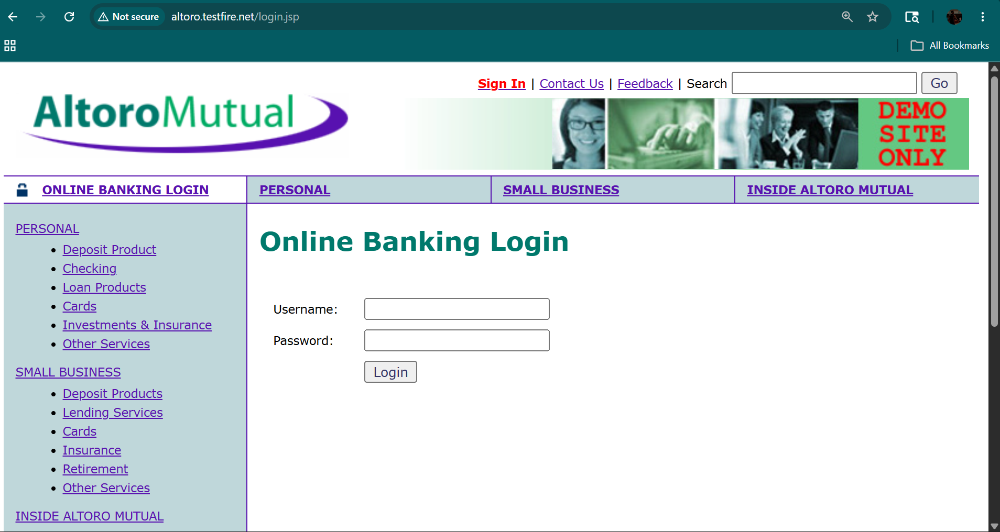
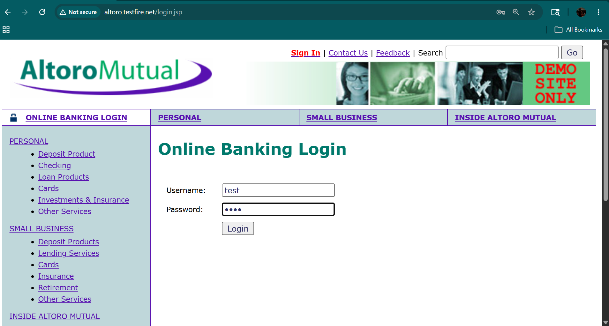
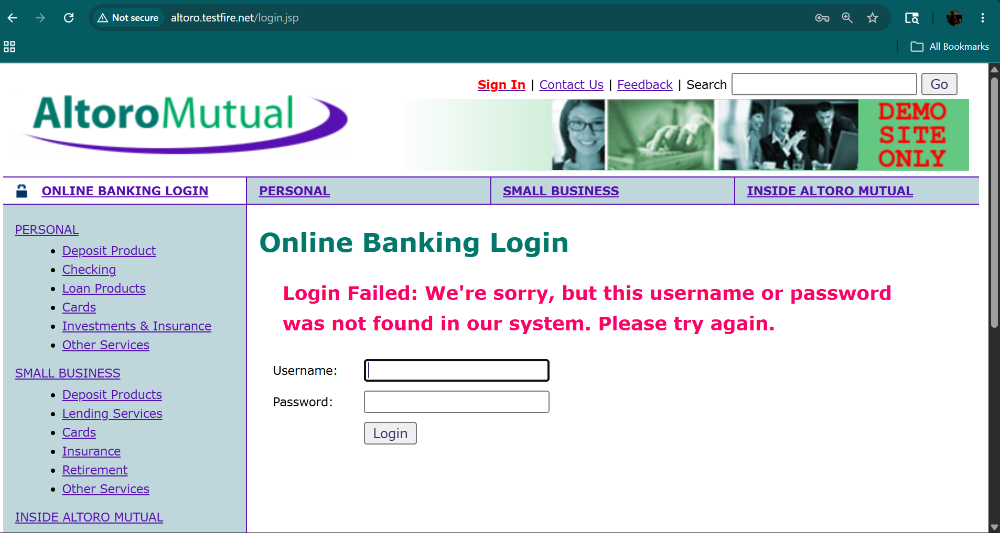
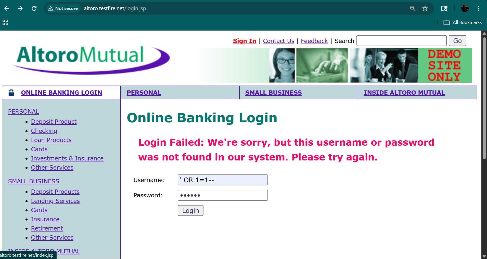
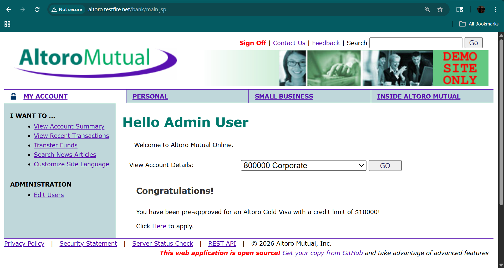

# Authentication Vulnerability - Altoro Mutual Lab

## Introduction
This lab demonstrates an authentication vulnerability in the Altoro Mutual application where user input is not properly validated, allowing potential login bypass.

---

## Objective
- Test login functionality  
- Identify authentication weaknesses  
- Attempt login bypass using malicious input  

---

## Application Overview
The application provides a login portal where users enter:

- Username  
- Password  

The system validates these credentials to grant access.

---

## Login Page

---

## Testing Authentication

### 🔹 Normal Login Attempt
- Entered valid/invalid credentials  
- Observed response  

---

### 🔹 Invalid Login Attempt
- Entered incorrect credentials  
- Application denied access  

---

## Injection Attempt

Tried payload:
---
' OR '1'='1--
---

### Observation
- Application behavior changed OR bypass attempt tested  
- Indicates improper input validation  

---

## Vulnerability Explanation
The application does not properly sanitize user input.

This may allow:
- SQL Injection  
- Authentication bypass  

---

## Result
- Authentication mechanism tested  
- Weak input validation observed  
- Potential for unauthorized access  

---

## Impact
- Unauthorized users may gain access to accounts  
- Sensitive user data can be exposed  
- Attackers can bypass authentication mechanisms  
- Leads to complete account compromise  

## CVSS Score

- CVSS Score: 9.1 (Critical)  
- Severity: Critical  

### Explanation
This vulnerability allows attackers to:
- Bypass authentication  
- Access unauthorized accounts  
- Compromise sensitive user data  

---

## Key Observations
- Input fields are not properly validated  
- Login mechanism is vulnerable  
- Application security is weak  

---

## Learning Outcome
- Learned how authentication can be bypassed  
- Understood importance of input validation  
- Observed real-world login vulnerability  

---
## Mitigation
- Use parameterized queries / prepared statements  
- Implement proper input validation  
- Use secure authentication mechanisms  
- Apply least privilege access control  

## Screenshots

### 1. Login Page

### 2. Normal Login Attempt

### 3. Invalid Login Attempt

### 4. Payload Injection

### 5. Result / Response

---

## Conclusion
This lab highlights how improper validation in authentication systems can lead to serious security risks such as unauthorized access and data compromise.