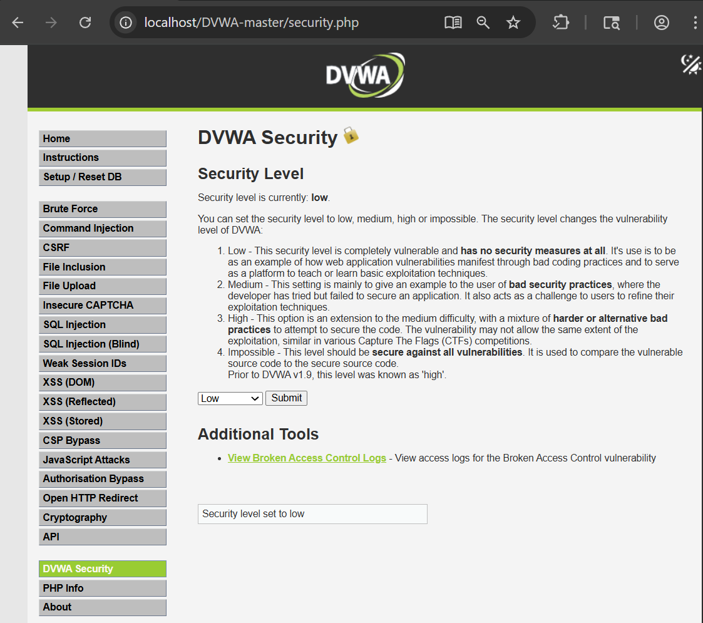
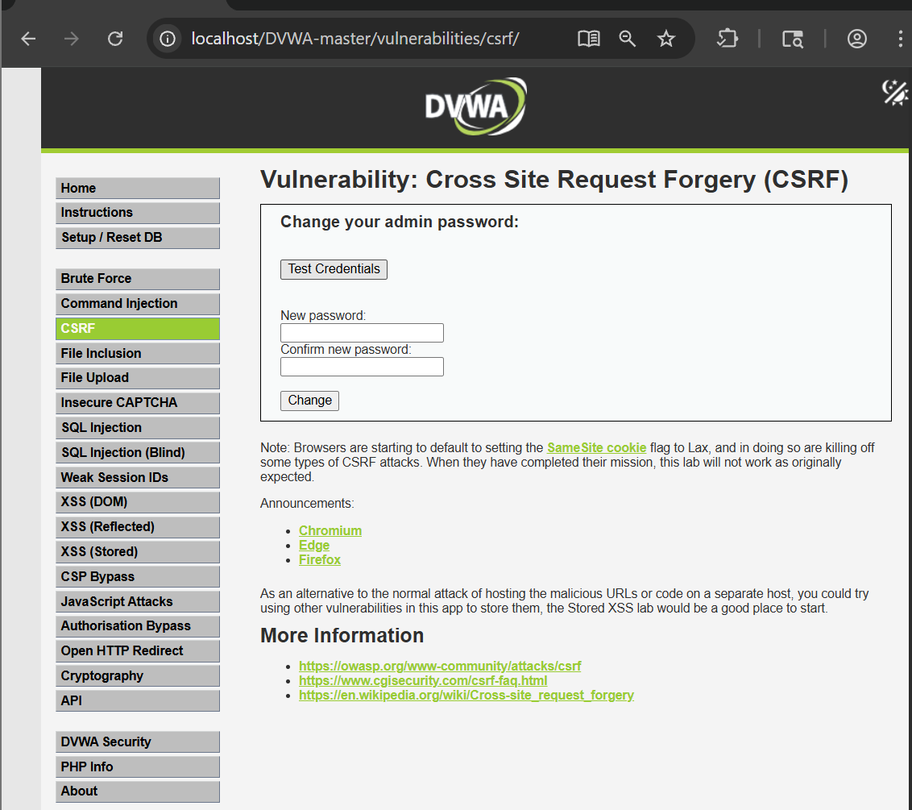
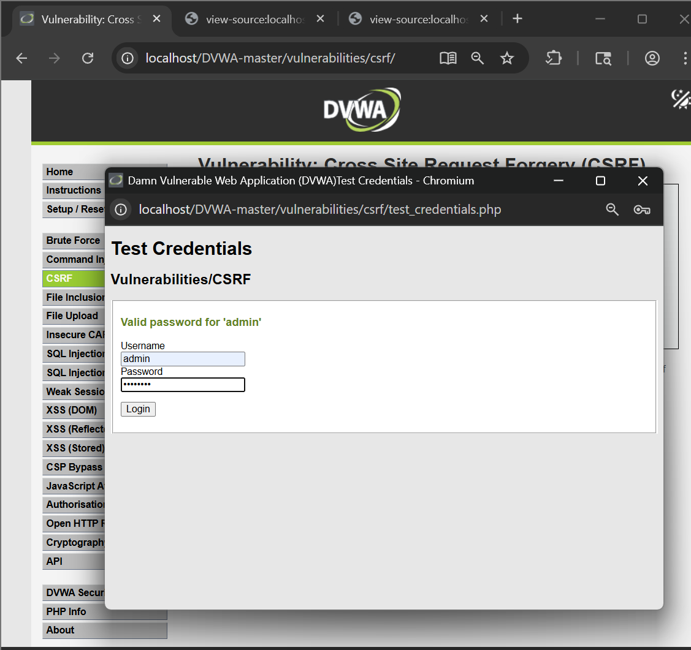
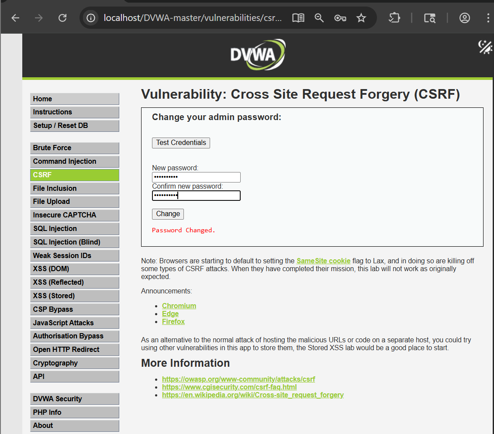
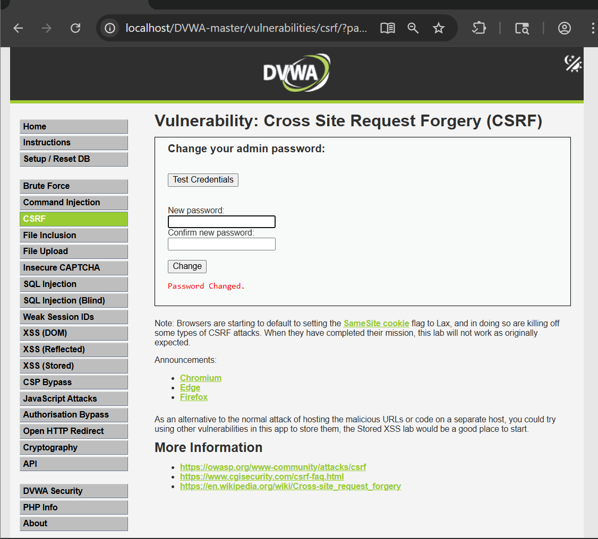
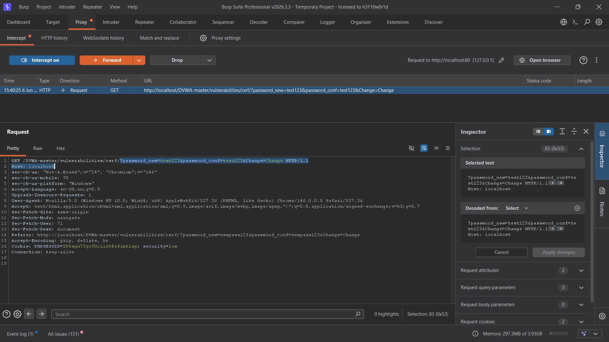
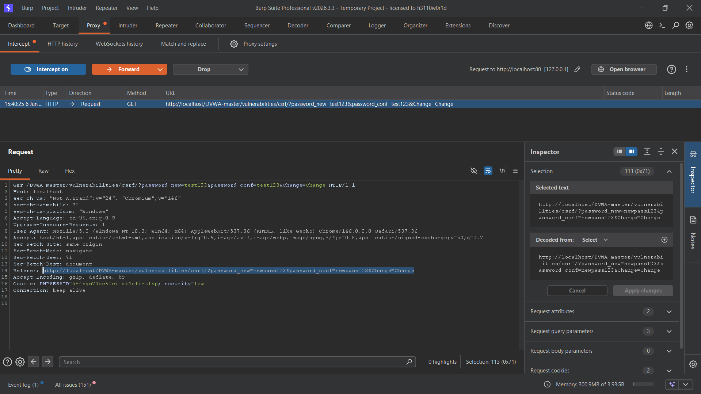
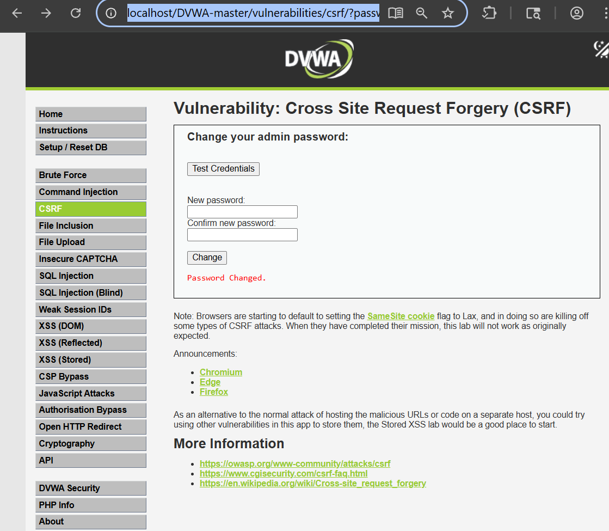
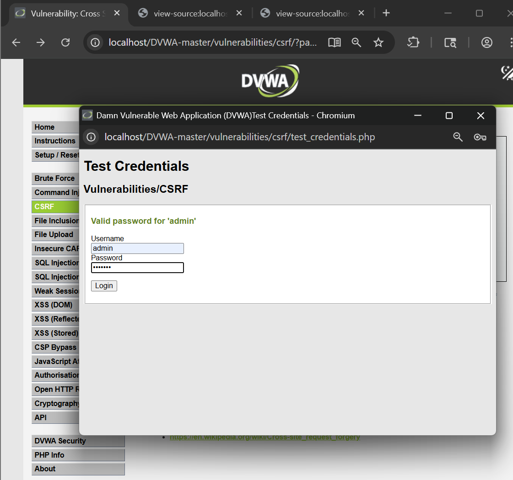

# Cross-Site Request Forgery (CSRF) – DVWA

## Objective

The objective of this lab was to understand and exploit a Cross-Site Request Forgery (CSRF) vulnerability in DVWA by forcing an authenticated user to change their password through a crafted request without their knowledge.

---

## Tools Used

- DVWA (Damn Vulnerable Web Application)
- Google Chrome
- Burp Suite Community Edition

---

## Lab Configuration

- DVWA Security Level: Low
- Vulnerability Module: CSRF

---

## What is CSRF?

Cross-Site Request Forgery (CSRF) is a web vulnerability that tricks an authenticated user into performing unintended actions on a web application.

If a victim is logged in, an attacker can craft a malicious link or webpage that causes the victim's browser to send a legitimate request to the application on the attacker's behalf.

---

## Step 1: Configure Security Level

The DVWA security level was set to **Low**.



---

## Step 2: Open the CSRF Module

The CSRF vulnerability page was opened from the DVWA navigation menu.



---

## Step 3: Analyze the Password Change Form

The page contains a form that allows users to change their password.



---

## Step 4: Capture the Request

The password change request was intercepted using Burp Suite.



---

## Step 5: Analyze Request Parameters

The request contained the following parameters:

```text
password_new=test123
password_conf=test123
Change=Change
```



---

## Step 6: Craft a CSRF URL

A malicious URL was created using the captured parameters.

```text
http://localhost/DVWA/vulnerabilities/csrf/?password_new=test123&password_conf=test123&Change=Change
```



---

## Step 7: Execute the CSRF Attack

The crafted URL was opened while authenticated to the application.

The request was processed automatically by the server.



---

## Step 8: Verify Password Change

The application displayed a successful password change message.



---

## Step 9: Confirm the Attack

The user logged out and successfully logged back in using the new password:

```text
Username: admin
Password: test123
```

This confirmed that the password was changed through the crafted CSRF request.



---

## Impact

A successful CSRF attack can allow an attacker to:

- Change account passwords
- Modify user settings
- Perform actions as the victim
- Take control of user accounts
- Abuse authenticated sessions

---

## Root Cause

The application accepts sensitive requests without verifying whether they originated from a legitimate user action. No anti-CSRF protections are implemented at the Low security level.

---

## Conclusion

The DVWA CSRF vulnerability was successfully exploited by crafting a URL that changed the authenticated user's password. The attack required no direct interaction with the application beyond visiting the malicious link, demonstrating the risks of missing CSRF protections.

---

## Recommendations

- Implement anti-CSRF tokens.
- Validate the Origin and Referer headers.
- Require password re-authentication for sensitive actions.
- Use SameSite cookie attributes.
- Perform regular security testing and code reviews.