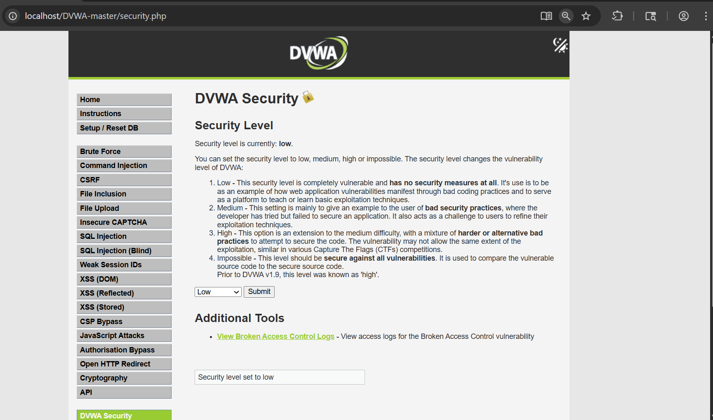
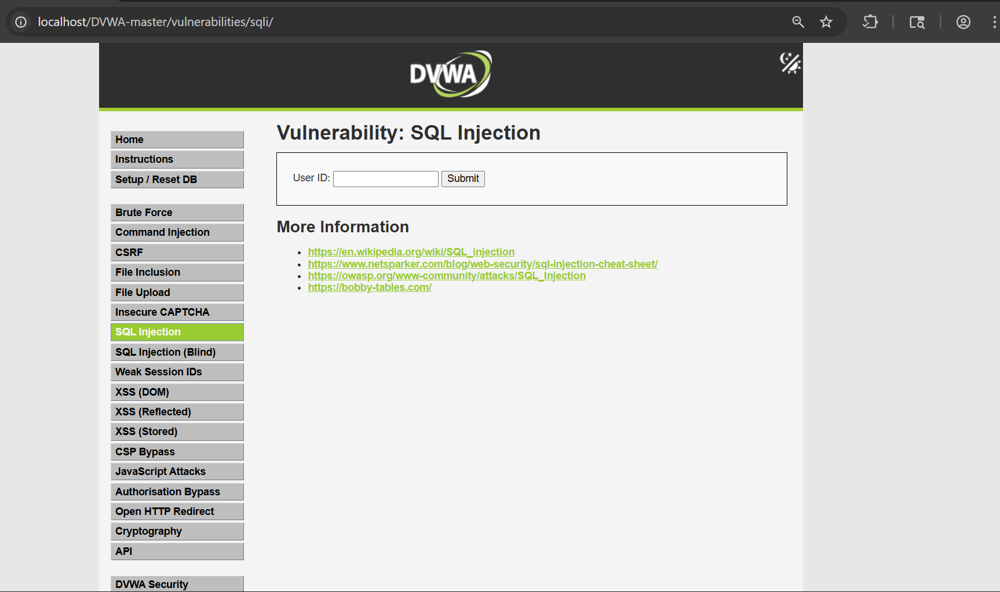
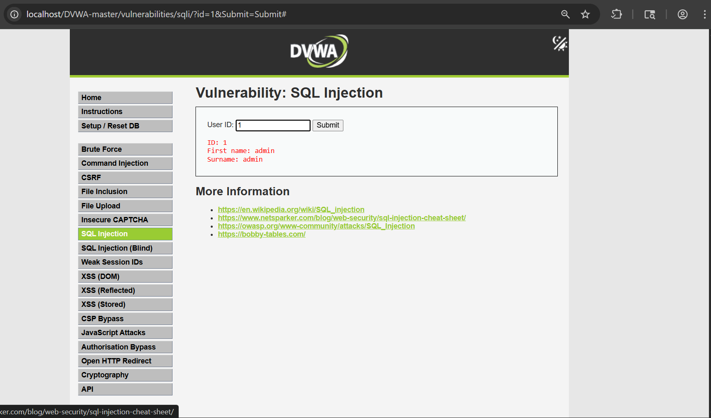
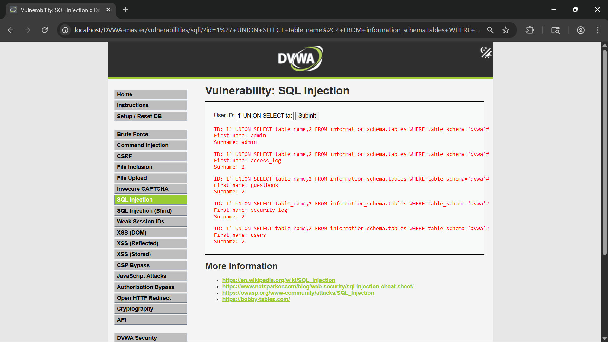

# DVWA SQL Injection (Low Security) – Complete Walkthrough

## Introduction

As part of my web application security learning journey, I performed a hands-on SQL Injection assessment on Damn Vulnerable Web Application (DVWA). The objective of this exercise was to understand how insecure handling of user input can allow attackers to manipulate database queries and gain access to sensitive information.

Rather than simply executing payloads, I focused on understanding the application's behavior, analyzing requests with Burp Suite, and documenting each step of the testing process. This walkthrough represents my practical experience with SQL Injection in a controlled lab environment.

> **Disclaimer:** All testing was performed on DVWA, an intentionally vulnerable application designed for security education purposes. No unauthorized systems were targeted.

---

# Lab Overview

SQL Injection is one of the most common and impactful web application vulnerabilities. It occurs when user-supplied input is incorporated directly into SQL queries without proper validation or parameterized handling.

Successful exploitation can lead to:

- Unauthorized data access
- Authentication bypass
- Database enumeration
- Information disclosure
- Complete database compromise

This lab demonstrates how a vulnerable application can be manipulated using specially crafted input.

---

# Lab Environment

| Component | Details |
|-----------|---------|
| Application | DVWA |
| Security Level | Low |
| Operating System | Windows |
| Web Server | Apache |
| Database | MySQL |
| Testing Tool | Burp Suite Community Edition |
| Browser | Burp Browser |

---

# Configuring the Environment

Before beginning the assessment, I configured DVWA to operate at the **Low** security level. This setting disables many of the defensive mechanisms that would otherwise prevent exploitation and allows the underlying vulnerability to be observed more clearly.



After saving the configuration, I navigated to the SQL Injection module.



At this point, the application presented a simple input field requesting a User ID.

---

# Understanding Normal Application Behaviour

Before attempting any attack payloads, I first wanted to understand how the application behaved under normal conditions.

I entered the following value:

```text
1
```

The application returned details associated with a single user account.



This confirmed that the supplied value was being used to perform a database lookup. Understanding normal behavior is important because it provides a baseline for identifying abnormal responses during testing.

---

# Initial SQL Injection Testing

After observing the application's normal functionality, I began testing for SQL Injection.

The following payload was entered:

```sql
1' OR '1'='1
```


This payload attempts to alter the logic of the backend SQL query by introducing a condition that always evaluates to true.

After submitting the request, the application displayed multiple user records rather than a single result.


This behavior strongly indicated that the application was vulnerable to SQL Injection.

---

# Request Analysis Using Burp Suite

To better understand how the application processed user input, I intercepted the request using Burp Suite.

The intercepted request clearly showed that the user-controlled parameter was being transmitted to the server.


By examining the request structure, it became evident that the application was accepting user input without applying sufficient filtering or validation.

---

# Repeater-Based Testing

To perform controlled testing without repeatedly interacting with the application interface, I sent the intercepted request to Burp Repeater.


Burp Repeater allowed me to modify payloads, resend requests, and compare responses efficiently. This feature proved extremely useful during the enumeration phase of the assessment.

---

# Determining the Number of Columns

A common step during SQL Injection testing is identifying the number of columns used by the underlying SQL query.

To achieve this, I used ORDER BY enumeration.

The first payload tested was:

```sql
1' ORDER BY 2#
```

The application processed the request successfully.


Next, I tested:

```sql
1' ORDER BY 3#
```

This time the application generated an error.


Based on these results, I concluded that the query likely contained **two columns**.

Determining the column count is essential because UNION-based attacks require the injected query to match the original query structure.

---

# UNION-Based Injection Testing

After identifying the column count, I tested whether UNION-based SQL Injection was possible.

The following payload was used:

```sql
1' UNION SELECT 1,2#
```


The values were successfully reflected in the response, confirming that UNION-based injection was possible and that the column count had been correctly identified.

This was an important milestone because it enabled further database enumeration.

---

# Database Enumeration

With UNION-based injection confirmed, I proceeded to gather information about the backend database.

To identify the current database, I used:

```sql
1' UNION SELECT database(),2#
```

The application returned the database name.


The database was identified as:

```text
dvwa
```

Knowing the active database is useful because it allows an attacker to focus subsequent enumeration efforts on relevant data structures.

---

# Database User Enumeration

Next, I identified the database account being used by the application.

The following payload was executed:

```sql
1' UNION SELECT user(),2#
```


The response revealed the database user account.

This information can help attackers understand privilege levels and assess the potential impact of a successful compromise.

---

# Table Enumeration

After identifying the target database, I attempted to enumerate its tables.

The following payload was used:

```sql
1' UNION SELECT table_name,2
FROM information_schema.tables
WHERE table_schema='dvwa'#
```

The application returned multiple table names.


The following tables were discovered:

```text
access_log
guestbook
security_log
users
```

The presence of a **users** table was particularly interesting because it potentially contains authentication-related information.

---

# Capturing Enumeration Requests

To better document the process, I captured the enumeration request within Burp Suite.


This screenshot illustrates how crafted payloads can be delivered through HTTP requests and how Burp Suite can be used to analyze and modify them during testing.

---

# Security Impact

The successful exploitation of this vulnerability demonstrated how insufficient input validation can expose critical database information.

An attacker exploiting a similar vulnerability in a production environment could potentially:

- Retrieve sensitive user data
- Enumerate database structures
- Access authentication information
- Bypass application controls
- Escalate attacks against the underlying system

The actual impact would depend on the privileges of the database account and the sensitivity of stored information.

---

# Final Result

The assessment successfully demonstrated:

- Detection of SQL Injection
- Verification through manipulated queries
- Column count discovery
- UNION-based SQL Injection
- Database identification
- Database user identification
- Table enumeration
- HTTP request analysis using Burp Suite



These findings confirm that the application is vulnerable to SQL Injection when operating at the Low security level.

---

# Remediation

Several defensive measures can prevent SQL Injection vulnerabilities:

## Use Parameterized Queries

Parameterized queries ensure that user input is treated as data rather than executable SQL code.

## Implement Input Validation

All user input should be validated against expected formats and lengths.

## Apply Least Privilege

Database accounts should be granted only the permissions necessary for application functionality.

## Use Stored Procedures Carefully

Properly implemented stored procedures can reduce injection risks.

## Conduct Security Testing

Regular security assessments and code reviews help identify vulnerabilities before deployment.

---

# Key Learning Outcomes

This lab provided practical experience with:

- SQL Injection fundamentals
- Burp Suite request analysis
- Repeater-based testing
- Database enumeration techniques
- UNION-based attacks
- Vulnerability documentation

More importantly, it demonstrated how a seemingly simple input field can become a gateway to sensitive backend information when proper security controls are absent.

---

# Conclusion

This exercise provided valuable hands-on experience with SQL Injection in a controlled environment. Through a combination of manual testing and Burp Suite analysis, I was able to identify the vulnerability, manipulate backend queries, enumerate database information, and understand the broader security implications of insecure database interactions.

The lab reinforced the importance of secure coding practices, particularly the use of parameterized queries and robust input validation. It also highlighted why SQL Injection continues to remain one of the most significant web application security risks despite being well understood for many years.