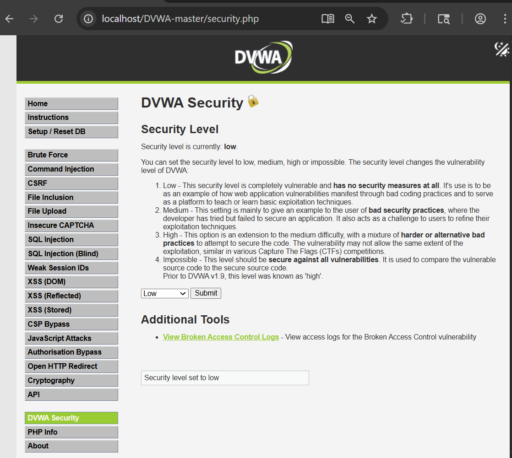
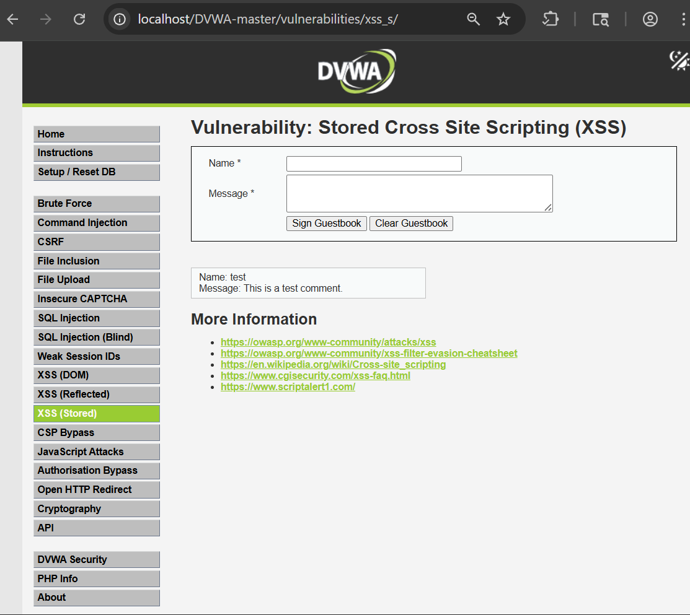
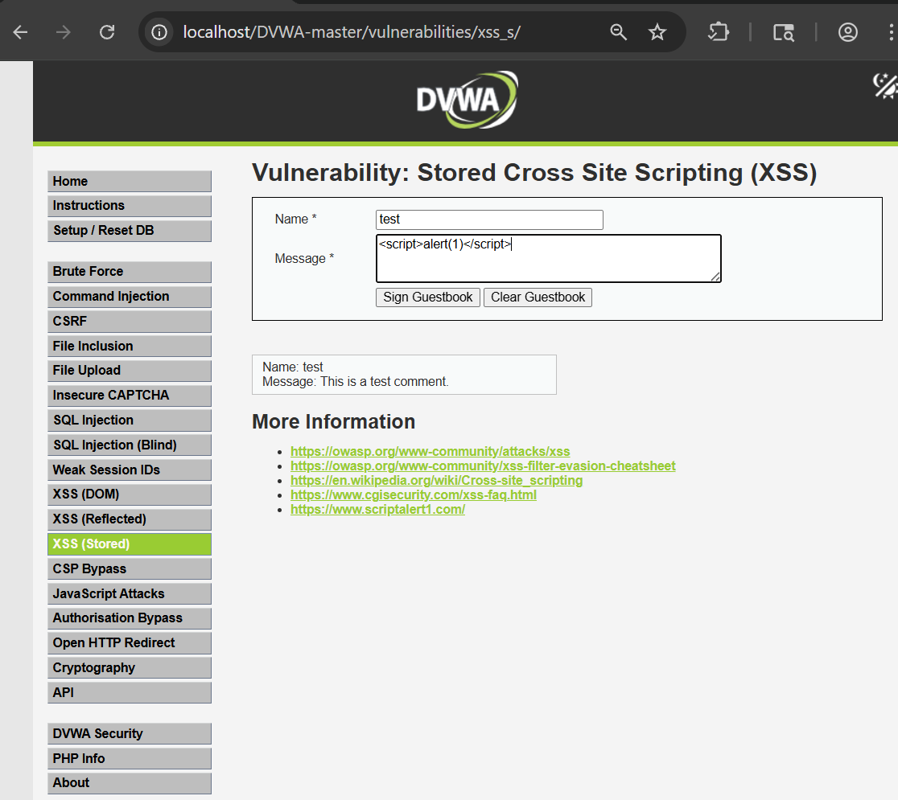
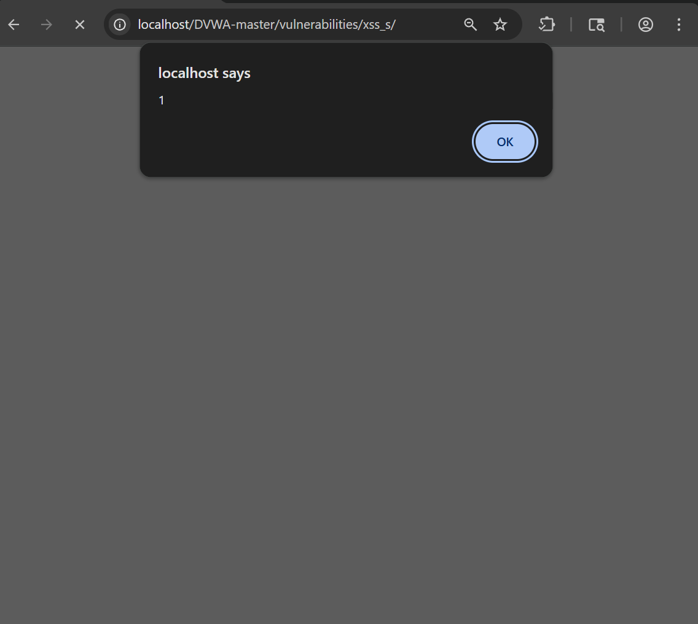
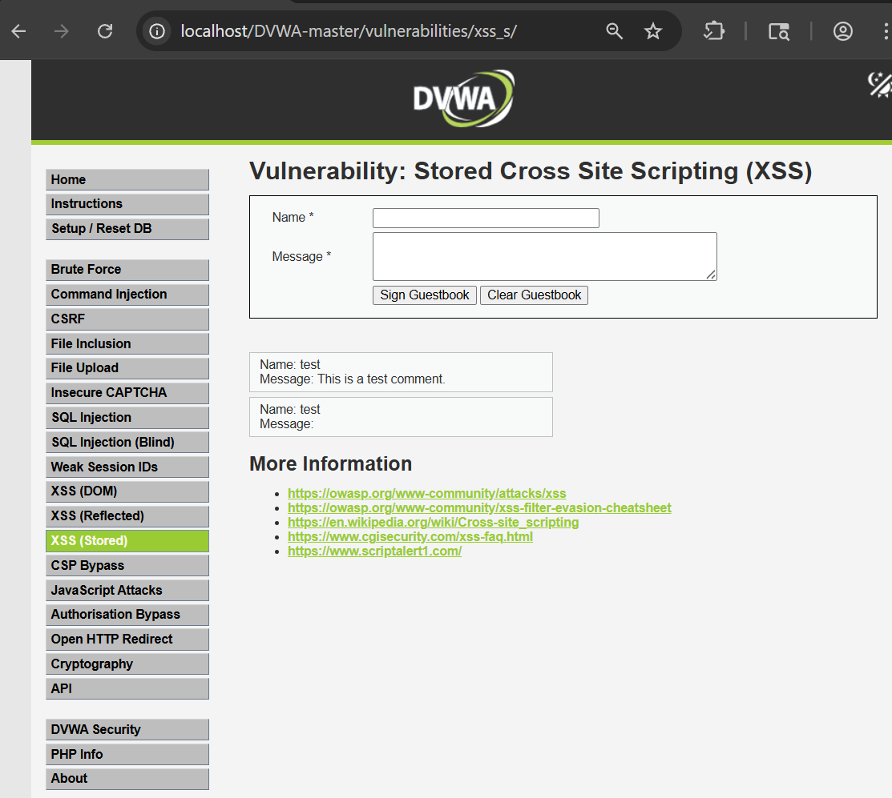
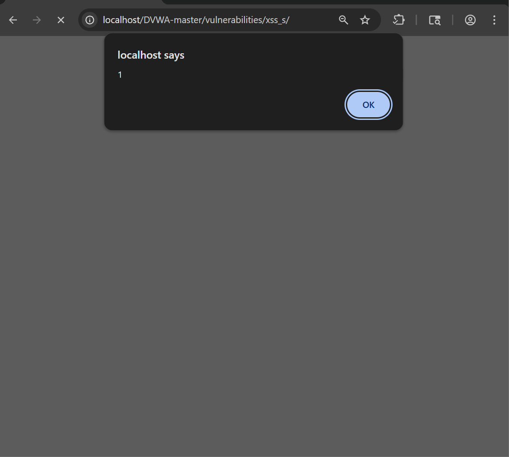
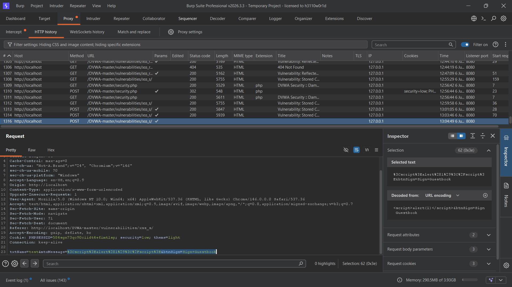
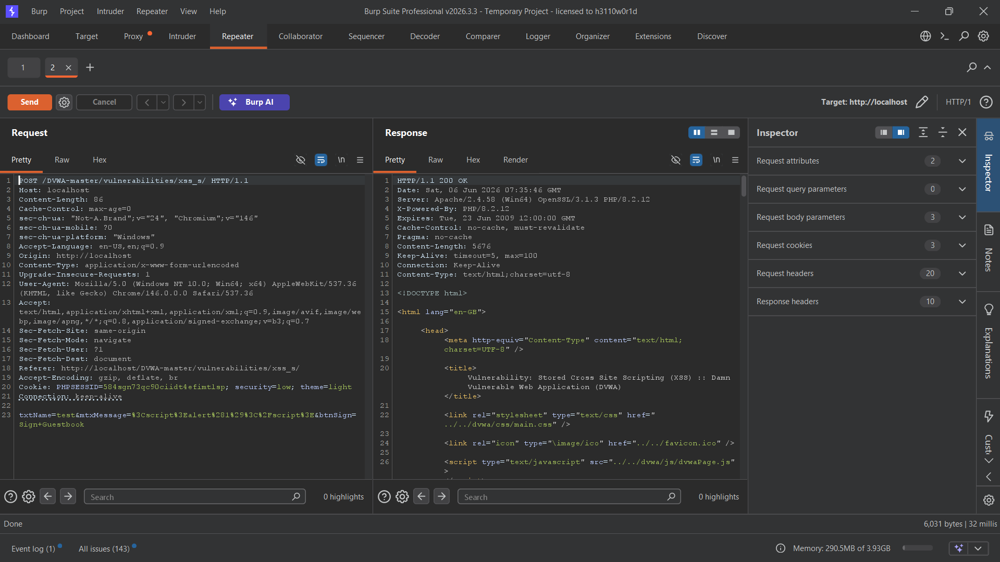
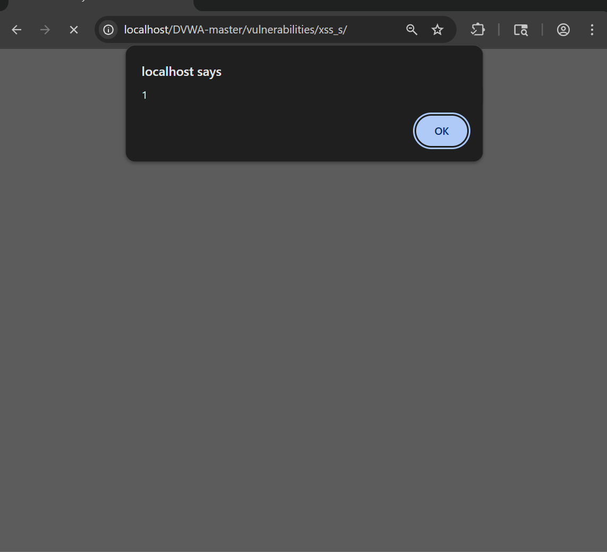

# Stored Cross-Site Scripting (XSS) – DVWA

## Objective

The objective of this lab was to identify and exploit a Stored Cross-Site Scripting (XSS) vulnerability in DVWA and understand how malicious JavaScript can be permanently stored and executed whenever users access the affected page.

---

## Tools Used

- DVWA (Damn Vulnerable Web Application)
- Google Chrome
- Burp Suite Community Edition
- Browser Developer Tools

---

## Lab Configuration

- DVWA Security Level: Low
- Vulnerability Module: XSS (Stored)

---

## What is Stored XSS?

Stored Cross-Site Scripting (Stored XSS) occurs when malicious input is permanently stored by a web application and later displayed to users without proper sanitization.

Unlike Reflected XSS, the payload is saved on the server and executes every time the affected page is loaded, making it more dangerous and impactful.

---

## Step 1: Configure Security Level

The DVWA security level was set to **Low** to observe the vulnerability without additional protections.



---

## Step 2: Access the Stored XSS Module

The Stored XSS module was opened from the DVWA navigation menu.



---

## Step 3: Submit a Malicious Payload

A JavaScript payload was entered into the guestbook message field.

### Payload

```html
<script>alert(1)</script>
```



---

## Step 4: Verify Initial Execution

After submitting the payload, a JavaScript alert box appeared, confirming successful execution.



---

## Step 5: Confirm Payload Storage

The submitted payload was stored in the guestbook and remained visible on the page.



---

## Step 6: Refresh the Page

The page was refreshed to verify persistence.

The payload executed again, demonstrating that the malicious script had been stored by the application.



---

## Step 7: Capture the Request Using Burp Suite

The request containing the payload was intercepted using Burp Suite Proxy.



---

## Step 8: Analyze the Response

The response was examined to observe how the application handled and displayed the stored payload.



---

## Step 9: Test an Alternative Payload

An image-based payload was used to trigger JavaScript execution through an event handler.

### Payload

```html

```

The payload executed successfully when rendered by the application.



---

## Impact

Successful exploitation of Stored XSS can lead to:

- Persistent JavaScript execution
- Session hijacking
- Credential theft
- Phishing attacks
- Unauthorized actions on behalf of users
- Website content manipulation

---

## Root Cause

The vulnerability exists because user-supplied input is stored and later rendered without proper sanitization, validation, or output encoding.

---

## Conclusion

The DVWA Stored XSS module was successfully exploited using multiple payloads. The application stored malicious input and executed it whenever the affected page was viewed. This demonstrates the risks associated with inadequate input validation and highlights the importance of secure output encoding practices.

---

## Recommendations

- Validate and sanitize all user inputs.
- Apply context-aware output encoding.
- Implement Content Security Policy (CSP).
- Restrict the use of dangerous HTML and JavaScript content.
- Conduct regular security testing to identify XSS vulnerabilities.