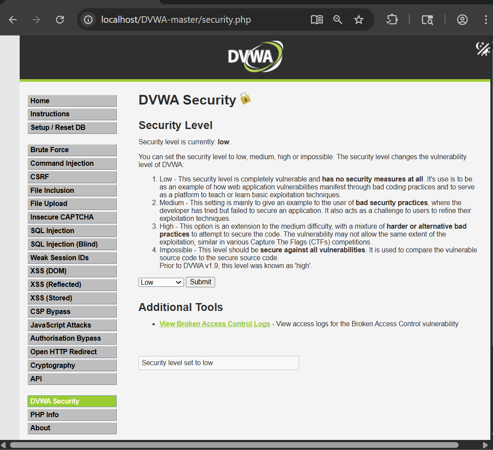
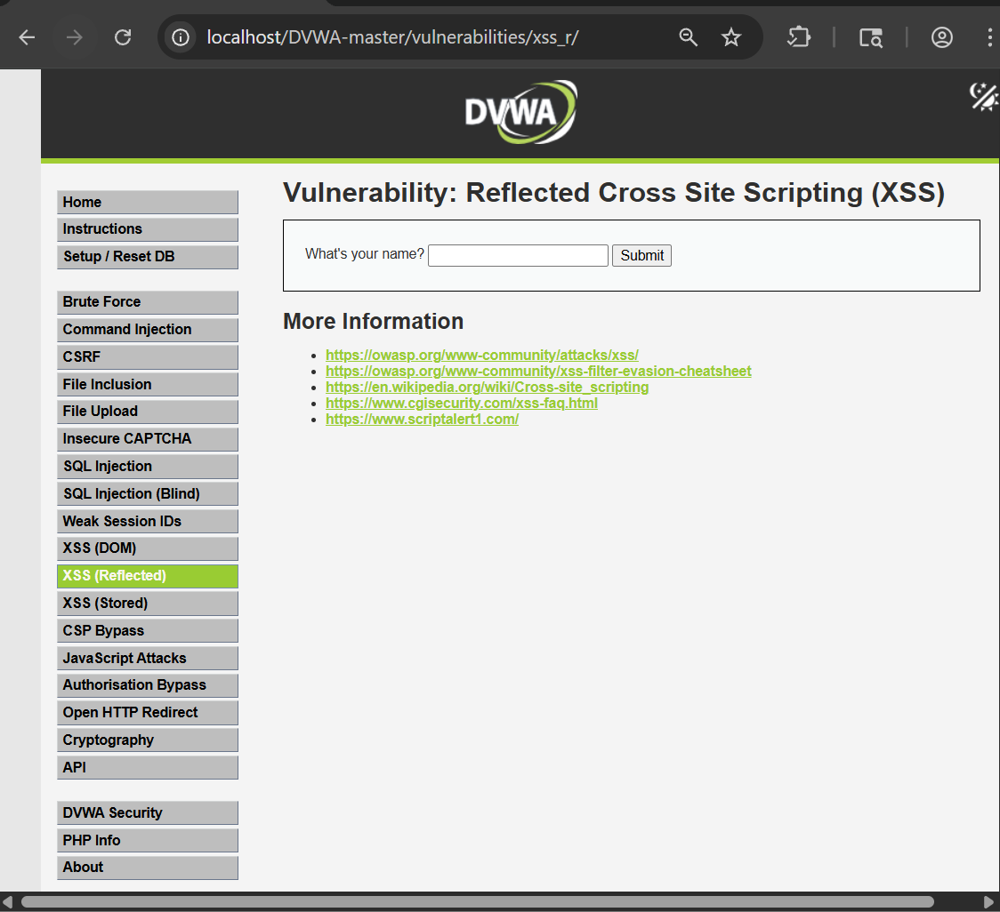
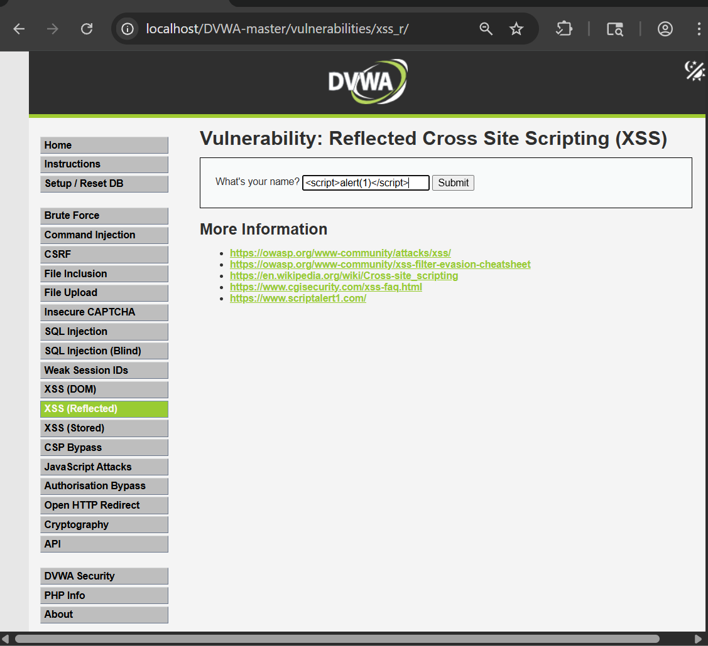
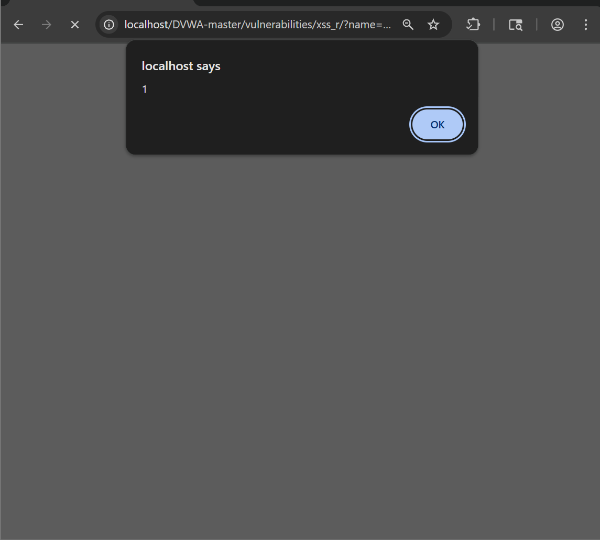
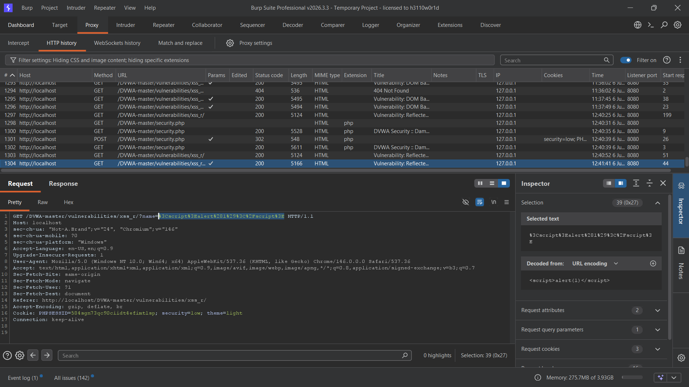
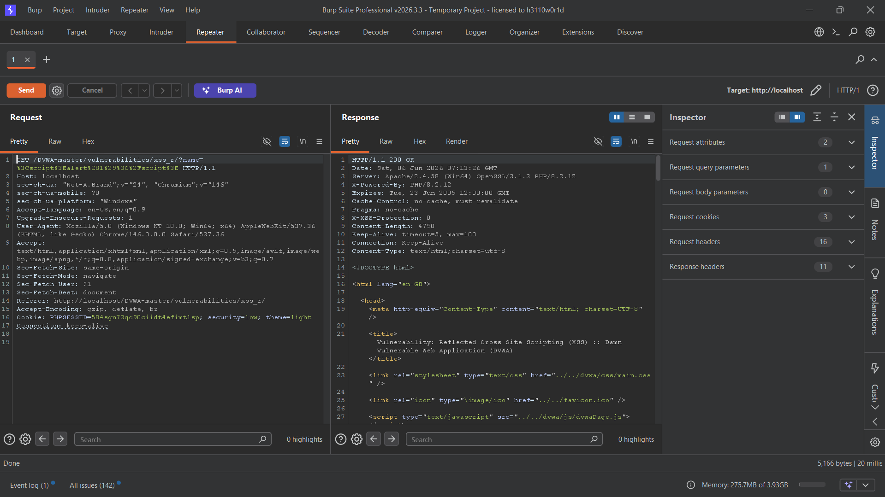
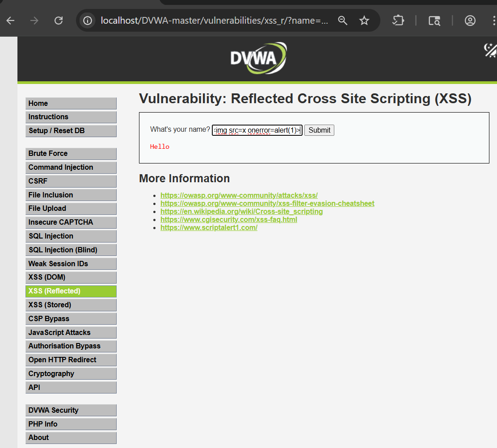
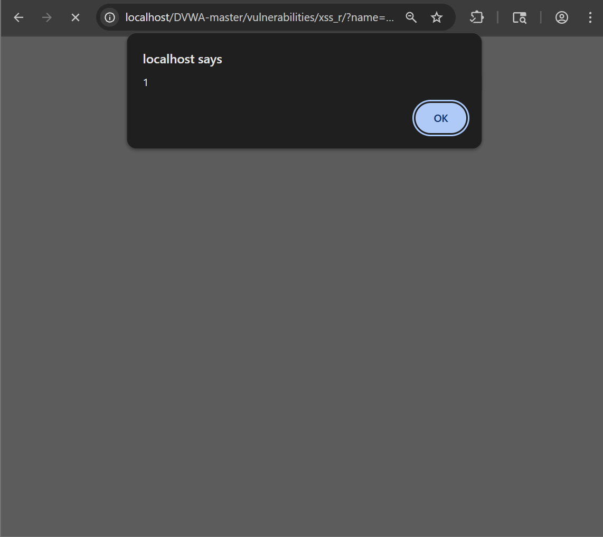
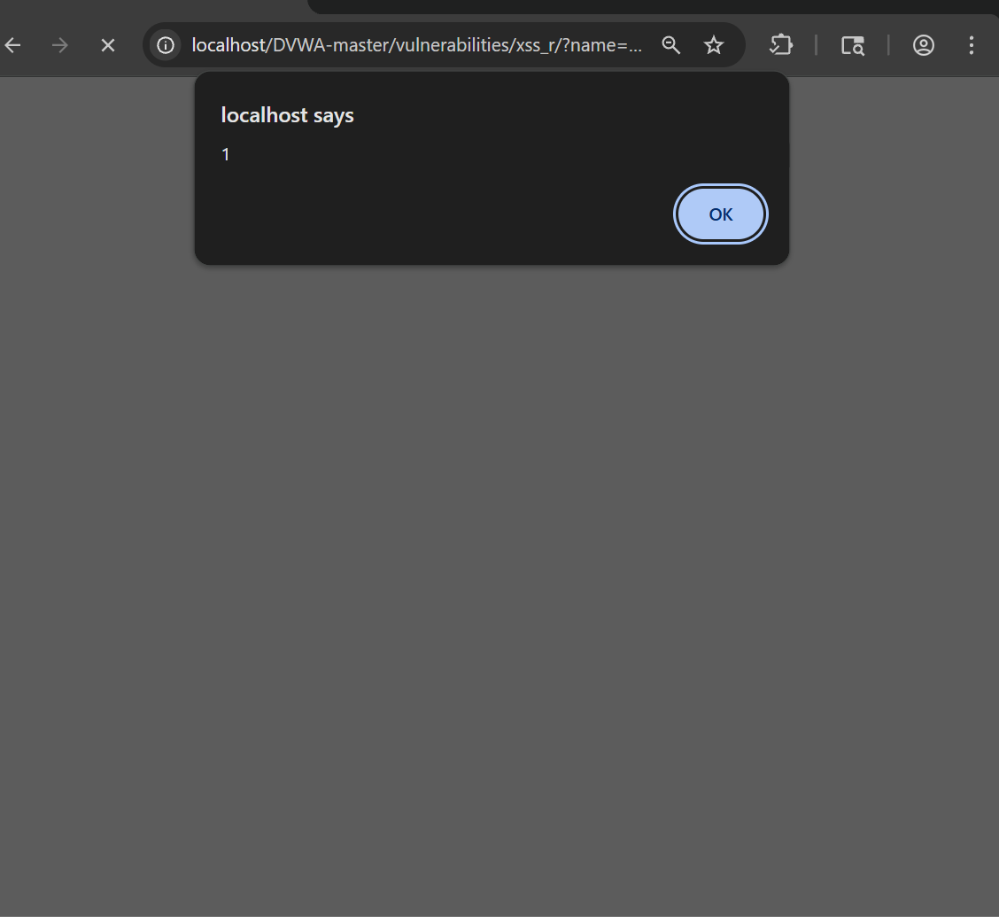

# Reflected Cross-Site Scripting (XSS) – DVWA

## Objective

The objective of this lab was to identify and exploit a Reflected Cross-Site Scripting (XSS) vulnerability in DVWA and understand how unsanitized user input can lead to JavaScript execution in a victim's browser.

---

## Tools Used

- DVWA (Damn Vulnerable Web Application)
- Google Chrome
- Burp Suite Community Edition
- Browser Developer Tools

---

## Lab Configuration

- DVWA Security Level: Low
- Vulnerability Module: XSS (Reflected)

---

## What is Reflected XSS?

Reflected Cross-Site Scripting (XSS) occurs when user-supplied input is immediately returned by the web application without proper sanitization or output encoding.

When a victim interacts with a maliciously crafted request, the injected JavaScript executes in their browser, potentially allowing attackers to steal sensitive information or manipulate webpage content.

---

## Step 1: Configure Security Level

The DVWA security level was set to **Low** to observe the vulnerability without additional protections.



---

## Step 2: Access the Reflected XSS Module

The Reflected XSS module was opened from the DVWA navigation menu.



---

## Step 3: Inject a Basic XSS Payload

A simple JavaScript payload was entered into the input field.

### Payload

```html
<script>alert(1)</script>
```



---

## Step 4: Verify Payload Execution

After submitting the payload, a JavaScript alert box appeared, confirming successful script execution.



---

## Step 5: Capture the Request Using Burp Suite

The request containing the XSS payload was intercepted using Burp Suite Proxy.



---

## Step 6: Analyze the Server Response

The intercepted request was sent to Burp Repeater to observe how the application reflected user input in the response.

The payload was found directly embedded within the returned page content.



---

## Step 7: Test an Alternative Payload

An image-based payload using the `onerror` event handler was tested.

### Payload

```html

```



---

## Step 8: Verify Alternative Payload Execution

The image payload successfully triggered JavaScript execution through the `onerror` event.



---

## Step 9: Test SVG-Based Payload

An SVG payload was used to trigger JavaScript execution through the `onload` event.

### Payload

```html
<svg/onload=alert(1)>
```



---

## Impact

Successful exploitation of Reflected XSS may lead to:

- Execution of arbitrary JavaScript
- Session hijacking
- Credential theft
- Phishing attacks
- Website defacement
- User impersonation

---

## Root Cause

The vulnerability exists because the application reflects user-controlled input back to the browser without proper validation, sanitization, or output encoding.

---

## Conclusion

The DVWA Reflected XSS module was successfully exploited using multiple payloads. The application failed to sanitize user input before displaying it in the response, allowing arbitrary JavaScript execution within the user's browser. This demonstrates the importance of input validation and secure output encoding to prevent Cross-Site Scripting attacks.

---

## Recommendations

- Validate and sanitize all user inputs.
- Implement context-aware output encoding.
- Use Content Security Policy (CSP).
- Avoid directly rendering untrusted data in HTML responses.
- Perform regular security testing to identify XSS vulnerabilities.