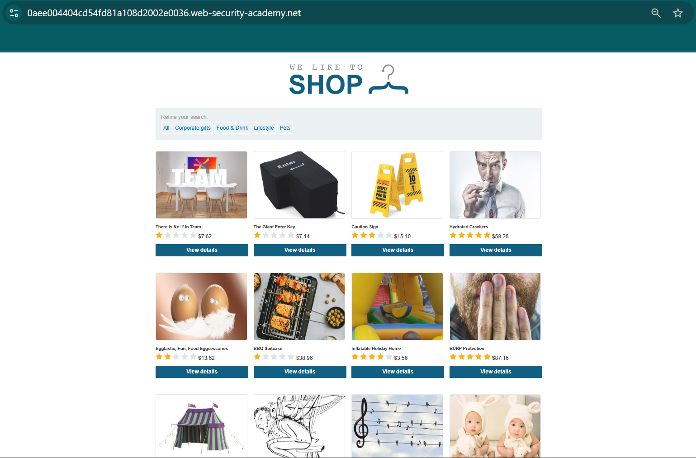
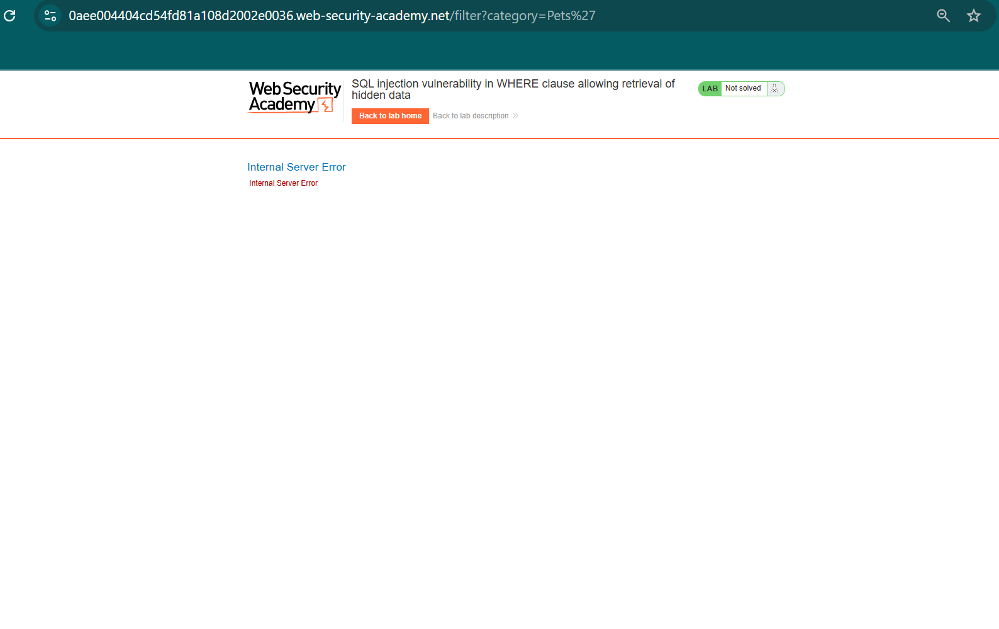
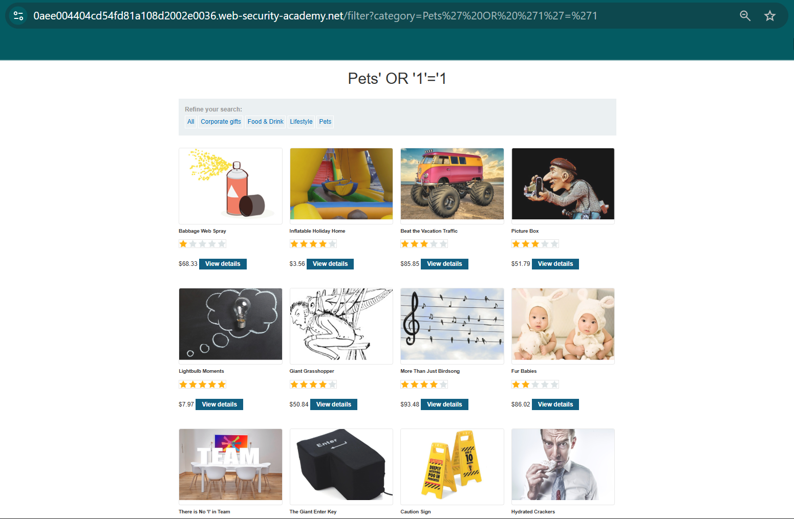
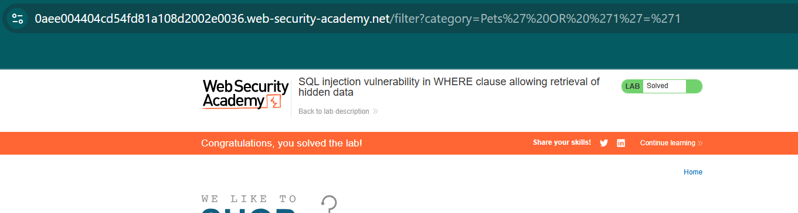
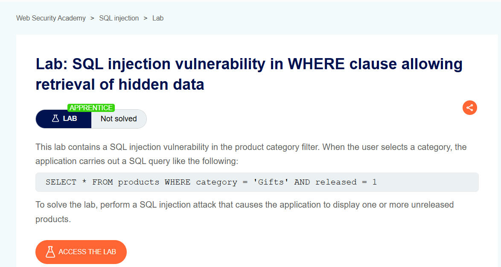
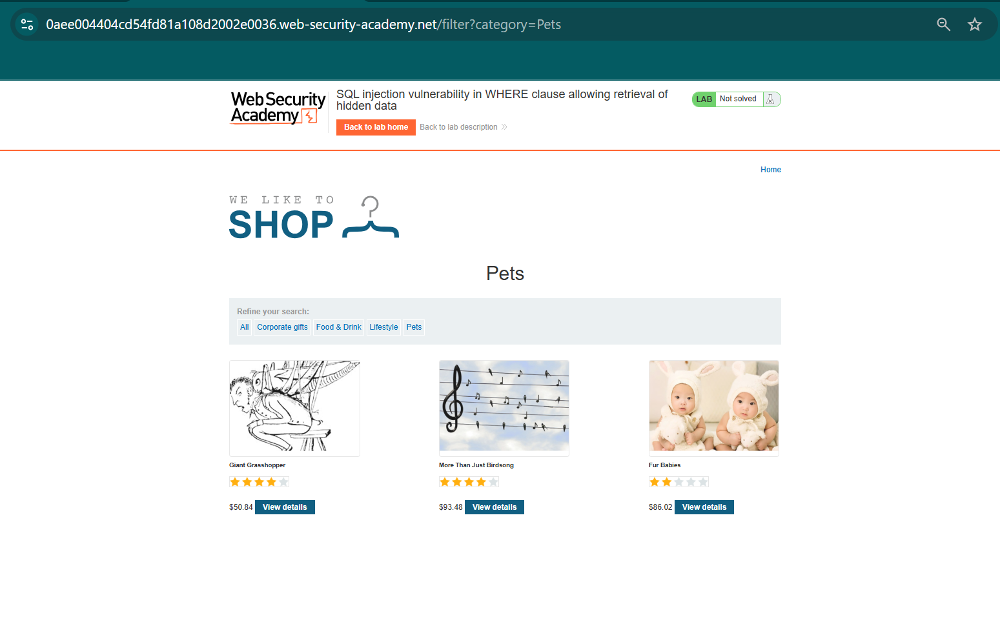
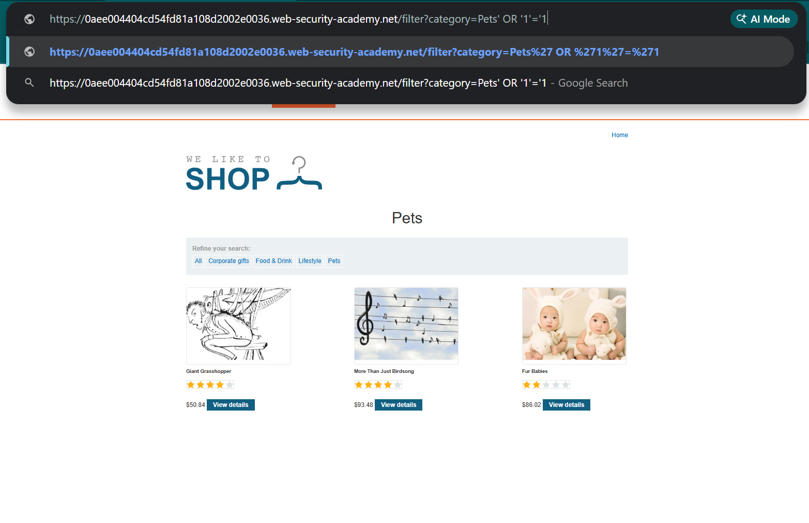

#  SQL Injection - WHERE Clause (PortSwigger Lab)

## Introduction
This lab demonstrates a basic SQL Injection vulnerability where user input is directly used in a backend SQL query without proper validation or sanitization.

---

## Objective
- Identify SQL Injection vulnerability  
- Understand how user input affects SQL queries  
- Retrieve hidden data by bypassing filters  

---

## Application Overview
The application filters products based on a category parameter.

Example: /filter?category=Pets  

- `category` → parameter  
- `Pets` → value  

---

## Original Page

---

## Testing for Vulnerability
The input was modified by adding a single quote:

Modified URL: /filter?category=Pets'

### Observation
- The application returned an error  
- This indicates improper handling of user input  
- Confirms the possibility of SQL Injection  

---

## Vulnerability Explanation
The backend query is expected to be:

SELECT * FROM products WHERE category = 'Pets';

When a single quote is added, the query structure breaks, indicating that user input is directly injected into the SQL query.

---

## Payload Used
/filter?category=Pets' OR '1'='1

### Explanation
- `'1'='1` is always TRUE  
- This condition bypasses the filter  
- The database returns all records  

---

## Result
- All products are displayed  
- Hidden data becomes visible  
- Filter restriction is bypassed  

---
## CVSS Score

- CVSS Score: 9.8 (Critical)
- Severity: Critical

### Explanation
This SQL Injection vulnerability allows attackers to:
- Access all database records
- Bypass application filters
- Retrieve hidden/sensitive data
- Potentially modify or delete data

## Lab Solved

---

## Key Observations
- User input is not validated  
- SQL query is dynamically constructed  
- Application is vulnerable to SQL Injection  

---

## Learning Outcome
- Understood basic SQL Injection attack  
- Learned how to test input fields  
- Observed real-world vulnerability behavior  
- Gained hands-on experience in web application security testing  

---

## Screenshots

### 1. Lab Description

### 2. Original Page

### 3. Normal Request

### 4. Error After Single Quote

### 5. Payload Injection

### 6. Successful Exploitation Result

### 7. Lab Solved Confirmation
