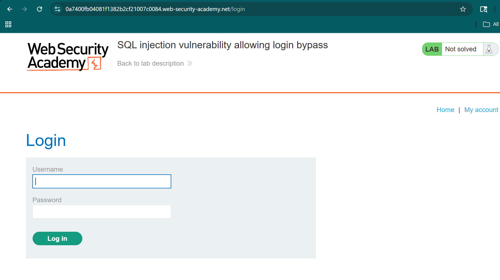
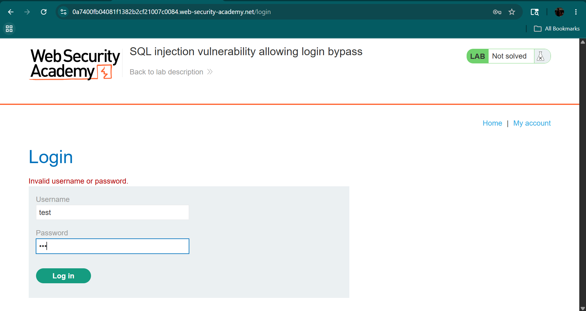
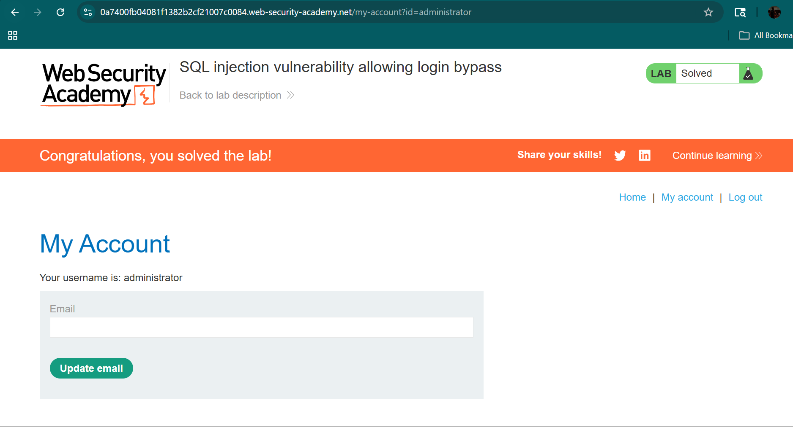
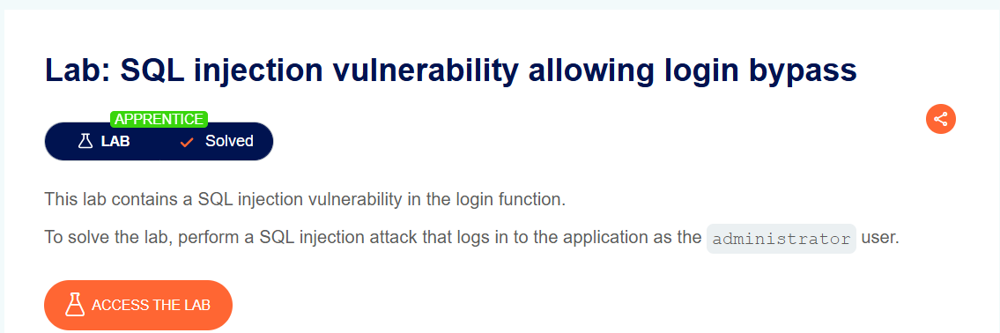
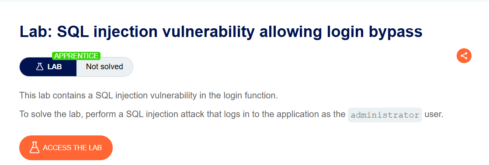
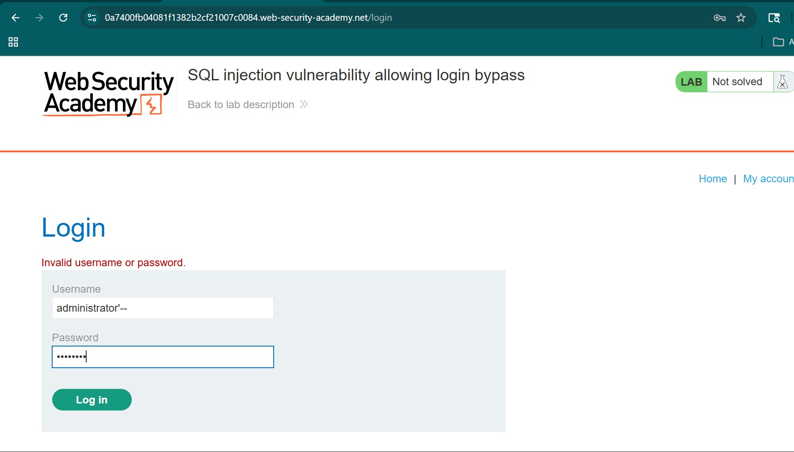

# SQL Injection - Login Bypass (PortSwigger Lab)

## Introduction
This lab demonstrates a SQL Injection vulnerability in a login form that allows an attacker to bypass authentication and log in without valid credentials.

---

## Objective
- Identify SQL Injection in login functionality  
- Bypass authentication mechanism  
- Access restricted account without password  

---

## Application Overview
The application provides a login form where users enter username and password.

---

## Login Page

---

## Testing for Vulnerability

A normal login attempt was performed using invalid credentials.

Example:
Username: test  
Password: test  

### Observation
- Login failed  
- Indicates authentication is working normally  

---

## Payload Used

Username:
administrator'--  

Password:
anything  

---

## Vulnerability Explanation

The backend query is expected to be:

SELECT * FROM users WHERE username = 'administrator' AND password = 'anything';

After injection:

SELECT * FROM users WHERE username = 'administrator'--' AND password = 'anything';

### Explanation
- `--` is a SQL comment operator  
- Everything after `--` is ignored  
- Password condition is bypassed  
- Login is successful without valid password  

---

## Result
- Successfully logged in as administrator  
- Authentication bypass achieved  

---
## CVSS Score

- CVSS Score: 9.8 (Critical)
- Severity: Critical

### Explanation
This SQL Injection vulnerability allows attackers to:
- Bypass login authentication
- Access admin account without password
- Gain unauthorized access to the system
- Compromise application security

## Lab Solved

---

##1  Key Observations
- User input not sanitized  
- SQL query directly constructed  
- Authentication logic vulnerable  

---

## Mitigation Techniques
- Use parameterized queries  
- Validate user input  
- Implement secure authentication logic  
- Avoid dynamic SQL queries  

---

## Learning Outcome
- Learned login bypass using SQL Injection  
- Understood SQL comment usage (`--`)  
- Observed real-world authentication vulnerability  

---

## Screenshots

### 1. Lab Description

### 2. Login Page

### 3. Failed Login Attempt

### 4. Payload Entered

### 5. Successful Login

### 6. Lab Solved Confirmation
