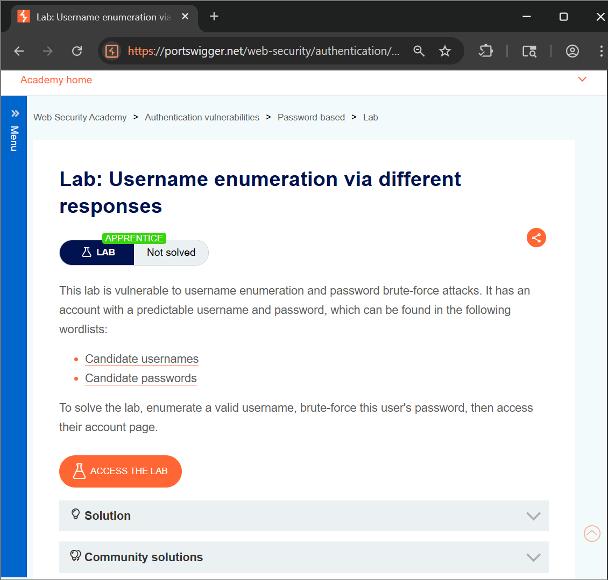
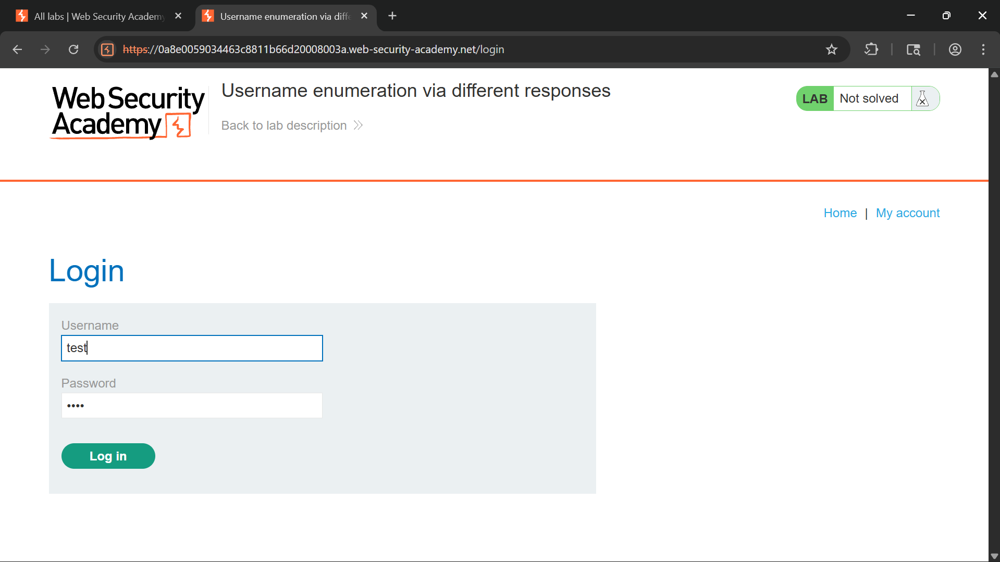
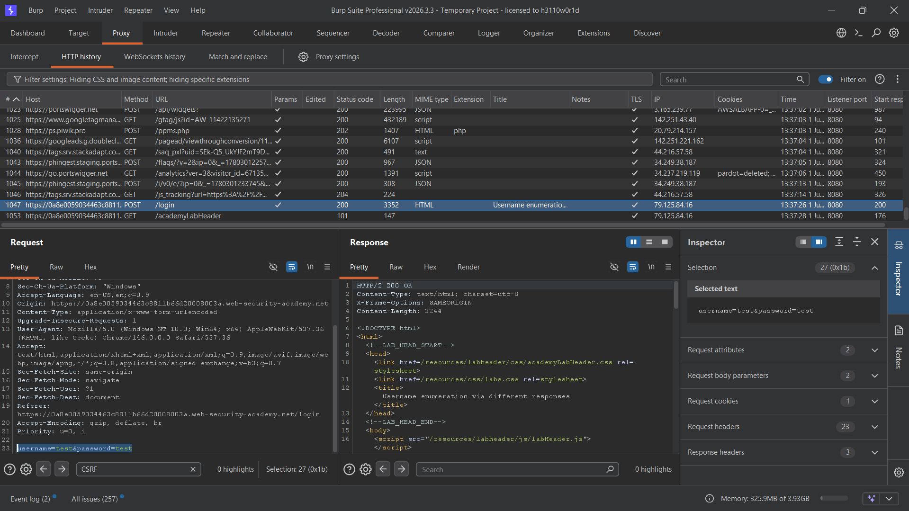
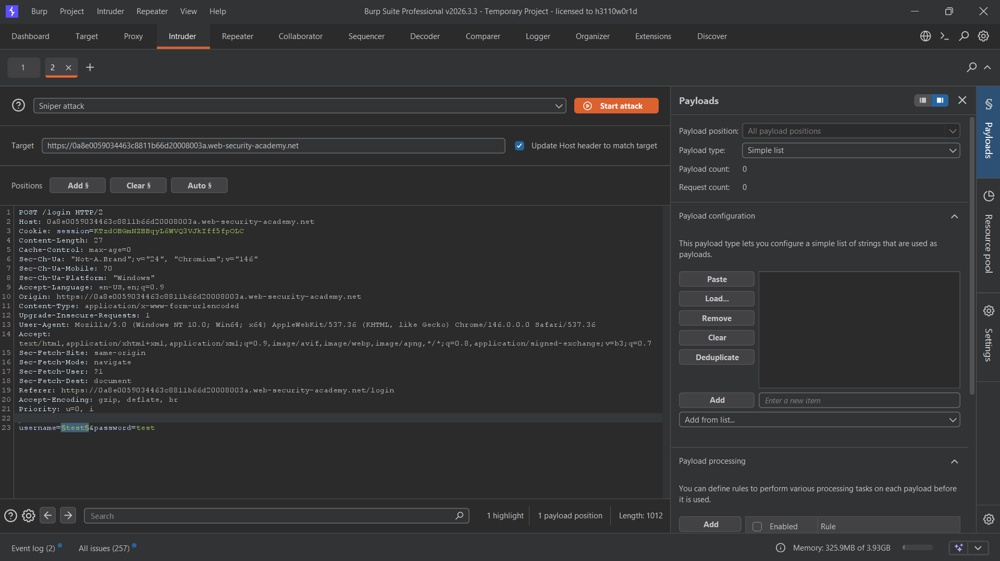
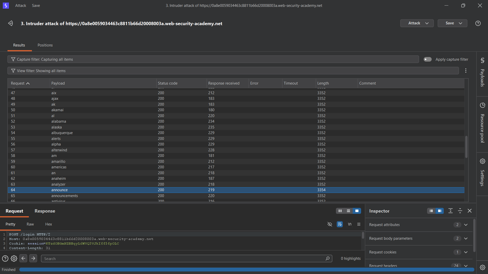
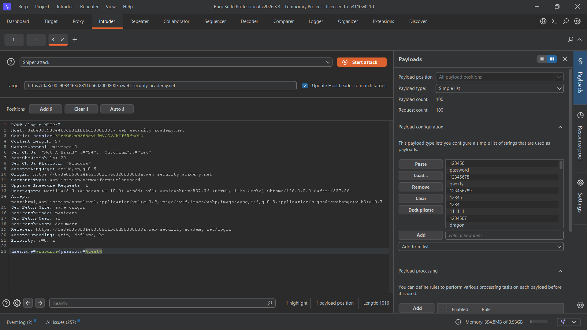
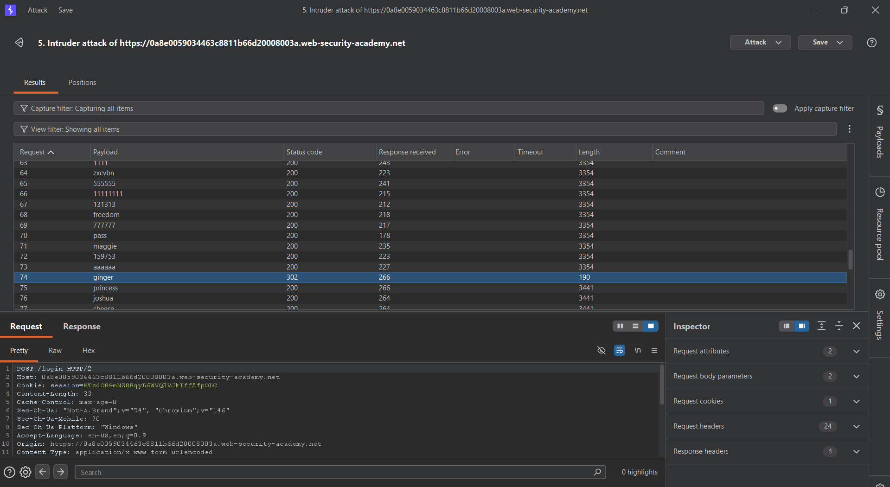
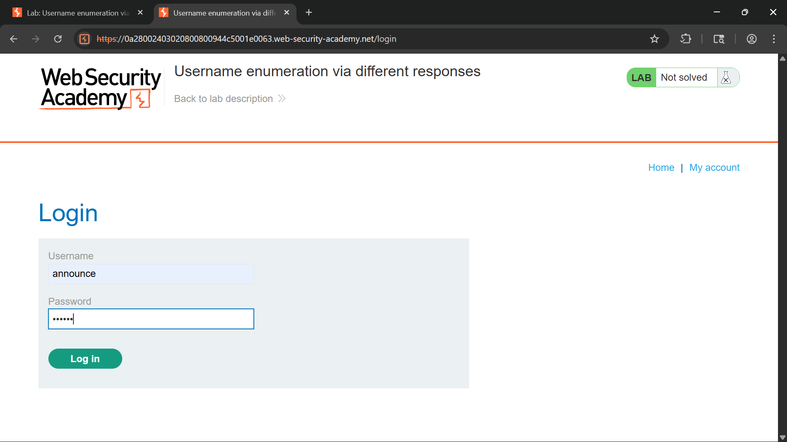
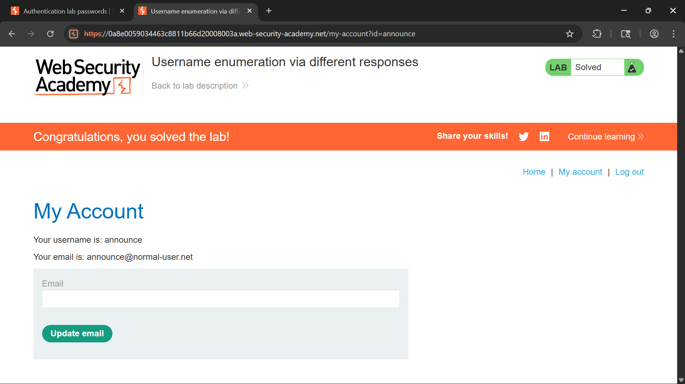

# Authentication Vulnerability – Username Enumeration via Different Responses

## Objective

The objective of this lab is to identify and exploit a **Username Enumeration** vulnerability caused by inconsistent authentication responses. By analyzing differences in the application's login responses, it is possible to identify valid usernames and perform a targeted password brute-force attack to gain unauthorized access.

---

## Tools Used

- Web Browser (Chrome)
- Burp Suite Professional
- Burp Intruder
- PortSwigger Web Security Academy

---

## Vulnerability Overview

Authentication mechanisms should provide consistent responses for all failed login attempts. If an application reveals whether a username exists through different error messages, response lengths, or status codes, attackers can enumerate valid usernames.

In this lab:

- The login functionality returns distinguishable responses for valid and invalid usernames.
- Response length analysis can be used to identify existing accounts.
- Once a valid username is discovered, password brute-forcing becomes significantly easier.
- Successful exploitation results in unauthorized access to the target account.

This vulnerability is commonly used as the first stage of a credential attack.

---

# Steps to Reproduce

---

## Step 1: Open the Lab

Launch the lab and navigate to the login page.

Review the authentication functionality and understand how login requests are processed.



---

## Step 2: Access the Login Page

Open the login page and attempt authentication using random credentials.

Example:

```text
Username: test
Password: test
```

Observe the application's response to failed authentication attempts.



---

## Step 3: Capture the Login Request

Submit invalid credentials and intercept the request using Burp Suite.

Send the captured request to Burp Intruder.

Example request:

```http
POST /login HTTP/1.1

username=test
password=test
```



---

## Step 4: Configure Username Enumeration Attack

In Burp Intruder:

- Select the username parameter as the payload position.
- Keep the password fixed.
- Load the provided username wordlist.

Example:

```http
username=§username§
password=test
```

Start the attack and wait for the responses.



---

## Step 5: Identify a Valid Username

Analyze the Intruder results.

Compare the response lengths and identify any response that differs from the others.

A unique response indicates that the username exists within the application.

Valid username identified:

```text
administrator
```



---

## Step 6: Configure Password Brute-Force Attack

After identifying a valid username:

- Fix the username as administrator.
- Move the payload position to the password parameter.
- Load the provided password wordlist.

Example:

```http
username=administrator
password=§password§
```

Launch the Intruder attack.



---

## Step 7: Identify the Correct Password

Review the Intruder results and sort by:

- Status Code
- Response Length

A successful authentication attempt returns:

```text
HTTP 302 Found
```

Valid credentials discovered:

```text
Username: administrator
Password: ginger
```



---

## Step 8: Login to the Administrator Account

Return to the login page and authenticate using the discovered credentials.

```text
Username: administrator
Password: ginger
```

Successful authentication grants access to the administrator account.



---

## Step 9: Lab Solved

After successfully authenticating as the administrator, the lab is marked as solved.



---

# Result

- Successfully identified a valid username.
- Performed a targeted password brute-force attack.
- Discovered administrator credentials.
- Logged into the administrator account.
- Solved the lab successfully.

---

# Impact

If this vulnerability exists in a production environment, attackers may be able to:

- Enumerate valid user accounts.
- Perform targeted brute-force attacks.
- Conduct credential stuffing attacks.
- Gain unauthorized access to sensitive accounts.
- Compromise administrative users.
- Increase the effectiveness of password guessing attacks.

Even when strong passwords are used, exposing valid usernames significantly reduces the attacker's workload.

---

# Mitigation

- Use generic authentication error messages.

  ```text
  Invalid username or password.
  ```

- Ensure identical responses for all failed login attempts.
- Implement account lockout policies.
- Apply rate limiting on authentication endpoints.
- Enable Multi-Factor Authentication (MFA).
- Monitor and alert on brute-force attempts.
- Deploy CAPTCHA mechanisms where appropriate.

---

# CVSS Score

**CVSS v3.1 Score: 8.8 (High)**

### Vector

```text
CVSS:3.1/AV:N/AC:L/PR:N/UI:N/S:U/C:H/I:H/A:L
```

---

# CVSS Explanation

- **AV:N (Network):** Exploitable remotely over the network.
- **AC:L (Low):** Requires minimal effort to exploit.
- **PR:N (None):** No authentication required.
- **UI:N (None):** No user interaction required.
- **S:U (Unchanged):** Impact remains within the vulnerable application.
- **C:H (High):** Potential exposure of sensitive information.
- **I:H (High):** Unauthorized access can compromise account integrity.
- **A:L (Low):** Limited impact on service availability.

---

# Conclusion

This lab demonstrates how seemingly minor differences in authentication responses can expose valid usernames to attackers. By leveraging Burp Intruder and response analysis, a valid administrator account was identified and successfully compromised through password brute-forcing. Applications should implement consistent authentication responses, rate limiting, account lockout mechanisms, and multi-factor authentication to mitigate the risk of username enumeration attacks.

---

# Key Learning

- Username Enumeration is often the first step in an authentication attack chain.
- Authentication systems should never reveal whether a username exists.
- Response length analysis is a powerful enumeration technique.
- Burp Intruder can automate large-scale authentication testing.
- Enumeration vulnerabilities significantly increase the success rate of brute-force attacks.
- Proper authentication controls are essential for securing user accounts.

---

