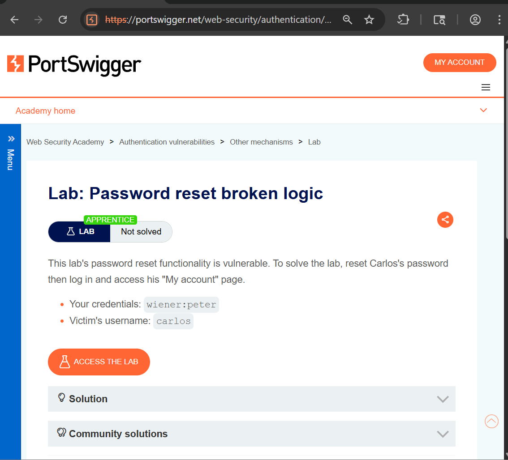
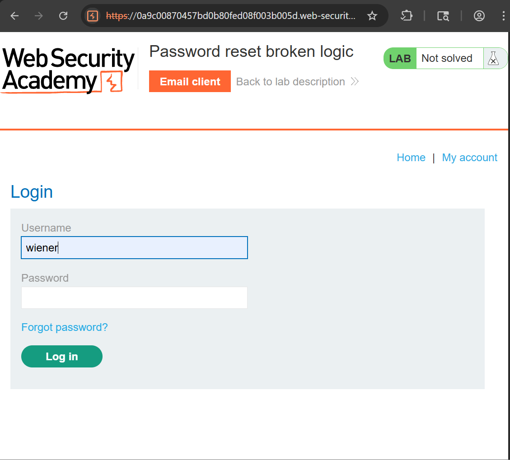
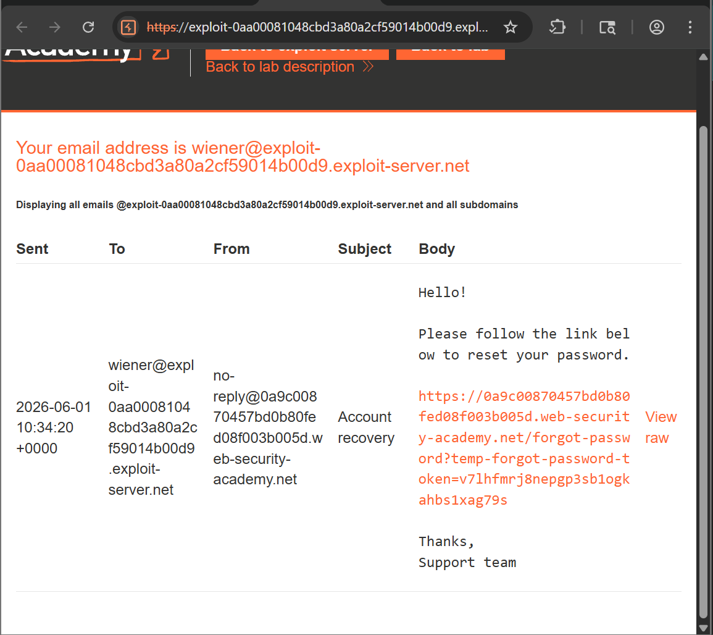
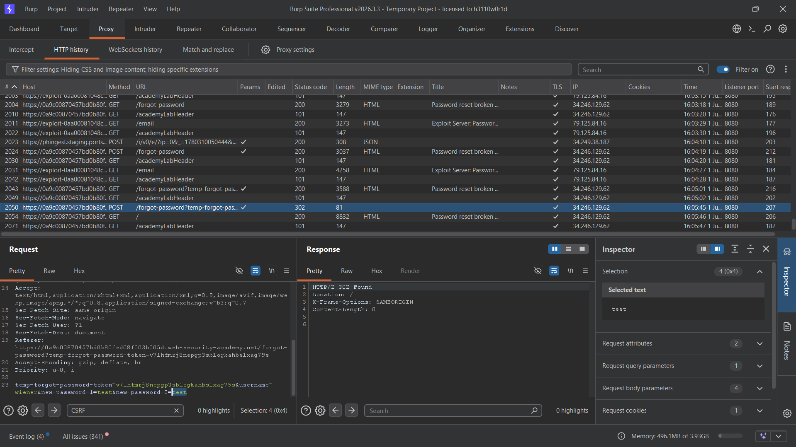
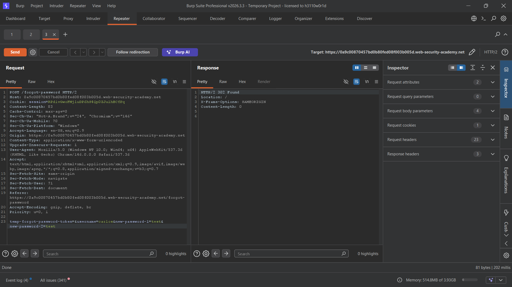
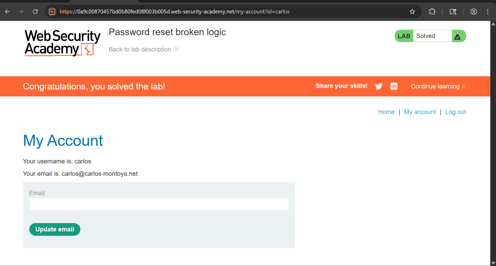

# Authentication Vulnerability – Password Reset Broken Logic

## Objective

The objective of this lab is to identify and exploit a flaw in the application's password reset functionality. Due to improper validation during the password reset process, it is possible to reset another user's password and gain unauthorized access to their account.

The goal is to reset Carlos's password, authenticate as Carlos, and access the **My Account** page.

---

## Tools Used

- Web Browser (Chrome)
- Burp Suite Community Edition
- PortSwigger Web Security Academy

---

## Vulnerability Overview

Password reset functionality is a critical component of account security. When implemented correctly, it allows legitimate users to regain access to their accounts while preventing unauthorized password changes.

A secure password reset process should:

1. Verify the identity of the user requesting the reset.
2. Generate a unique reset token.
3. Associate the token with the intended user account.
4. Validate the token before allowing a password change.

In this lab, the application contains a **Broken Password Reset Logic** vulnerability. The password reset workflow does not properly validate which account the reset token belongs to, allowing an attacker to manipulate the request and reset another user's password.

As a result, an attacker can take control of arbitrary user accounts without knowing their current password.

---

# Understanding the Vulnerability

The application allows users to request a password reset link through the "Forgot Password" functionality.

Normally, the reset token generated for one user should only be usable for that specific account.

A secure workflow would look like:

```text
Password Reset Request
        ↓
Generate Unique Token
        ↓
Bind Token to User
        ↓
Validate Token Ownership
        ↓
Allow Password Change
```

However, in this lab the application trusts user-controlled data during the password reset process.

This allows an attacker to modify the request and reset another user's password using a valid reset token.

---

# Steps to Reproduce

---

## Step 1: Open the Lab

Launch the lab and review the challenge description.

The lab provides the following credentials:

```text
Username: wiener
Password: peter
```

Target user:

```text
Username: carlos
```

The objective is to gain access to Carlos's account.



---

## Step 2: Initiate a Password Reset Request

Navigate to the login page and select the **Forgot Password** option.

Submit a password reset request for the Wiener account.

```text
Username: wiener
```

The application generates a password reset link and sends it to the email client.



---

## Step 3: Retrieve the Password Reset Token

Access the email client and open the password reset email.

Locate the password reset link and identify the reset token provided by the application.

The token will be used during the password reset process.



---

## Step 4: Intercept the Password Reset Request

Open the reset link and proceed with the password change process.

Enter a new password and intercept the password reset request using Burp Suite.

Send the request to Repeater for further analysis.



---

## Step 5: Exploit the Broken Reset Logic

Analyze the intercepted request and identify the parameter containing the username.

The request resembles:

```http
POST /forgot-password
```

```text
temp-forgot-password-token=TOKEN
username=wiener
new-password-1=Password123!
new-password-2=Password123!
```

Modify the username parameter:

```text
username=carlos
```

while keeping the valid reset token unchanged.

Submit the modified request.

Because the application fails to properly validate token ownership, Carlos's password is updated instead of Wiener's.



---

## Step 6: Login as Carlos

Return to the login page.

Authenticate using:

```text
Username: carlos
Password: Password123!
```

Access Carlos's account page successfully.

The lab is now solved.



---

## Result

- Successfully analyzed the password reset workflow.
- Obtained a valid password reset token.
- Identified improper validation within the reset process.
- Reset Carlos's password without authorization.
- Gained access to Carlos's account.
- Successfully solved the lab.

---

## Impact

A vulnerable password reset mechanism can have severe security consequences.

Potential impacts include:

- Full account takeover.
- Unauthorized access to sensitive information.
- Privilege escalation.
- Compromise of administrative accounts.
- Data theft and unauthorized actions.
- Loss of trust in authentication mechanisms.

Since password reset functionality directly affects account ownership, flaws in its implementation are often considered high-risk vulnerabilities.

---

## Mitigation

To prevent password reset vulnerabilities:

### 1. Bind Reset Tokens to Specific Users

Each token should be associated with a single account and validated server-side.

### 2. Validate Token Ownership

The application must verify that the token belongs to the user whose password is being changed.

### 3. Avoid Trusting Client-Supplied Usernames

Sensitive account information should never be trusted solely from user-controlled requests.

### 4. Use Secure Random Tokens

Generate cryptographically secure reset tokens with sufficient entropy.

### 5. Expire Reset Tokens

Reset tokens should expire after a short period and become invalid after use.

### 6. Perform Security Testing

Regularly test authentication and password recovery workflows for logic flaws.

---

## CVSS Score

**CVSS v3.1 Score: 8.8 (High)**

### Vector

```text
CVSS:3.1/AV:N/AC:L/PR:N/UI:R/S:U/C:H/I:H/A:N
```

---

## CVSS Explanation

- **AV:N (Network):** Exploitable remotely.
- **AC:L (Low):** Requires minimal effort.
- **PR:N (None):** No privileges required.
- **UI:R (Required):** User interaction required to initiate the workflow.
- **S:U (Unchanged):** Impact remains within the vulnerable application.
- **C:H (High):** Sensitive information may be exposed.
- **I:H (High):** Account integrity is compromised.
- **A:N (None):** No direct impact on availability.

---

## Conclusion

This lab demonstrates how logic flaws in password reset functionality can lead to complete account compromise. By manipulating a password reset request, it was possible to reset another user's password without authorization and gain access to their account.

Password recovery mechanisms are highly sensitive security features and must enforce strict server-side validation to ensure that reset tokens can only be used by their intended recipients.

---

## Key Learning

- Password reset functionality is a common target for attackers.
- Security vulnerabilities are not always technical; business logic flaws can be equally dangerous.
- Reset tokens must be bound to specific user accounts.
- User-controlled parameters should never determine account ownership.
- Broken authentication workflows can lead directly to account takeover.
- Testing password reset functionality is an essential part of web application security assessments.