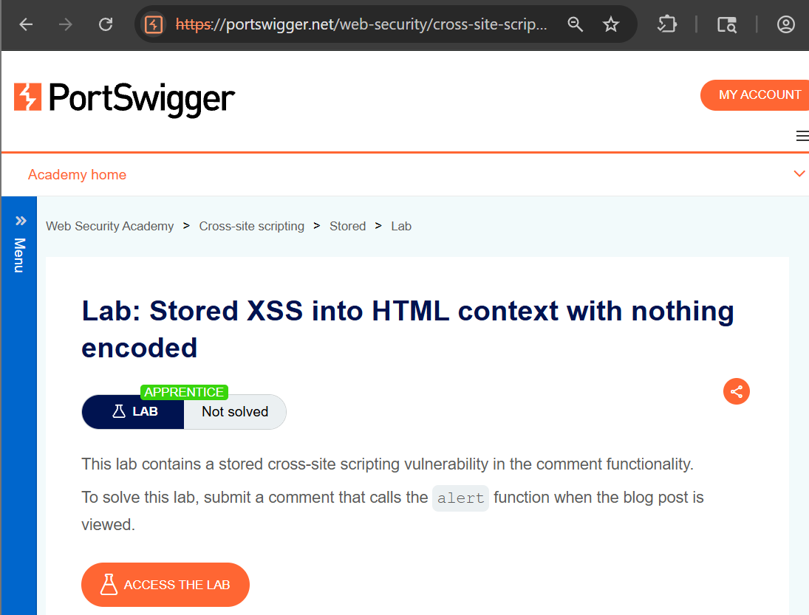
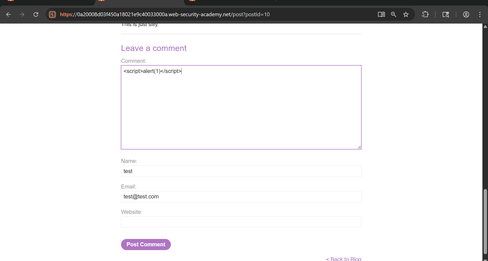
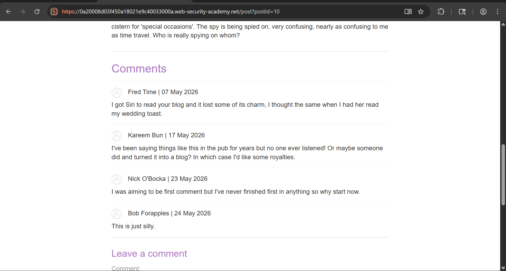
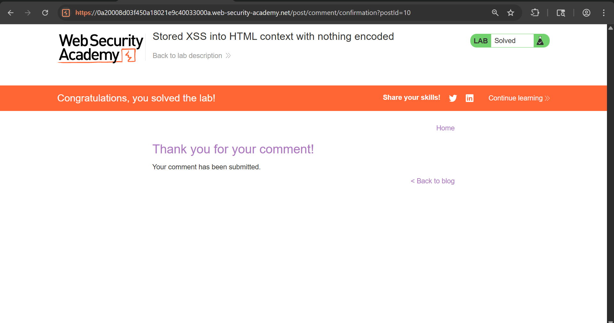

# Stored XSS into HTML Context (No Encoding)

## Objective

To identify and exploit a **Stored Cross-Site Scripting (XSS)** vulnerability where user input is stored on the server and executed in the browser when the page is viewed.

---

## Tools Used

- Web Browser
- PortSwigger Web Security Academy

---

## Vulnerability Overview

Stored XSS occurs when user input is:
1. Stored in the server (database)
2. Rendered later in the application
3. Executed by the browser due to lack of sanitization

In this lab, the comment functionality does not validate or encode user input.

---

## Steps to Reproduce

### Step 1: Analyze Lab

Opened the lab and understood that the comment section is vulnerable.

---

### Step 2: Inject Malicious Payload

Entered the following payload in the comment field:
---

---

---

### Step 3: Submit Comment

Submitted the form. The application stored the input without sanitization.

---

### Step 4: Payload Execution

When the page reloaded, the script executed automatically.

---

### Step 5: Lab Solved

The alert popup confirmed successful exploitation.

---

## Result

- Malicious script was stored in the server
- Automatically executed when page loaded
- Confirmed Stored XSS vulnerability

---

## Impact

- Persistent attack affecting all users
- Session hijacking
- Credential theft
- Defacement of web content

---

## CVSS Score

**CVSS v3.1 Score:** 6.8 (Medium)

### Vector:
---
CVSS:3.1/AV:N/AC:L/PR:N/UI:R/S:C/C:L/I:L/A:N

---

---

## CVSS Explanation

- **AV:N** → Exploitable over network  
- **AC:L** → Easy to exploit  
- **PR:N** → No authentication required  
- **UI:R** → Requires user interaction (page load)  
- **S:C** → Affects user browser  
- **C:L / I:L** → Data exposure & modification possible  
- **A:N** → No availability impact  

---

## Severity

**Medium**

Although user interaction is required, the persistent nature makes it more dangerous than reflected XSS.

---

## Conclusion

The application is vulnerable to Stored XSS due to improper input validation and output encoding. This allows attackers to inject malicious scripts that execute in other users' browsers, leading to serious security risks.

---

## Key Learning

- Always validate and sanitize user input
- Encode output before rendering
- Never trust user-controlled data

