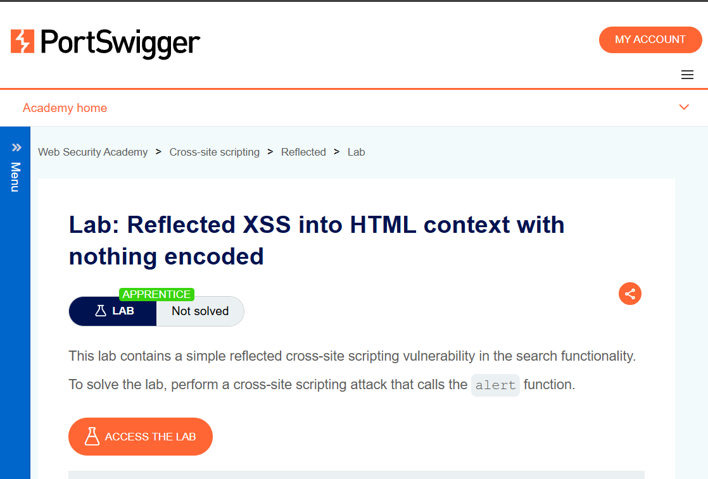
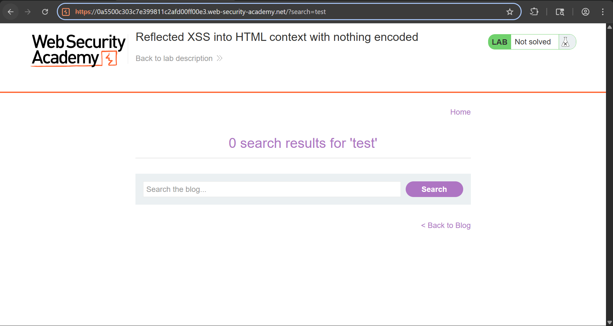
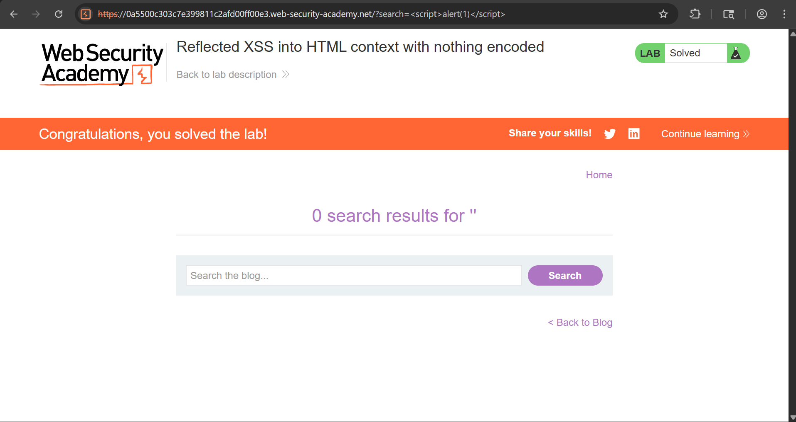

# Reflected XSS into HTML Context (No Encoding)

## Objective

To identify and exploit a Reflected Cross-Site Scripting (XSS) vulnerability where user input is reflected in the response without proper sanitization.

---

## Tools Used

- Web Browser
- PortSwigger Web Security Academy

---

## Steps to Reproduce

### Step 1: Analyze Lab
Opened the lab and observed the functionality.

---

### Step 2: Identify Input Reflection
Entered a normal value (`test`) in the search bar and observed it reflected in the URL.

---

### Step 3: Exploit XSS
Injected the payload:
---

---

The payload executed successfully, triggering a JavaScript alert.

---

## Result

Successfully executed JavaScript in the browser, confirming the presence of a Reflected XSS vulnerability.

---

## Impact

- Arbitrary JavaScript execution
- Session hijacking
- Credential theft

---
## CVSS Score

**CVSS v3.1 Score:** 6.1 (Medium)

### Vector:
CVSS:3.1/AV:N/AC:L/PR:N/UI:R/S:C/C:L/I:L/A:N

---

## Explanation

- **Attack Vector (AV):** Network → can be exploited remotely  
- **Attack Complexity (AC):** Low → easy to execute  
- **Privileges Required (PR):** None → no login needed  
- **User Interaction (UI):** Required → victim must click/search  
- **Scope (S):** Changed → affects user browser  
- **Confidentiality Impact (C):** Low → possible data exposure  
- **Integrity Impact (I):** Low → content manipulation possible  
- **Availability Impact (A):** None  

---

## Severity

**Medium**

Reflected XSS requires user interaction, but still allows execution of malicious scripts in the victim's browser.
## Conclusion

The application is vulnerable to Reflected XSS due to lack of input validation and output encoding.