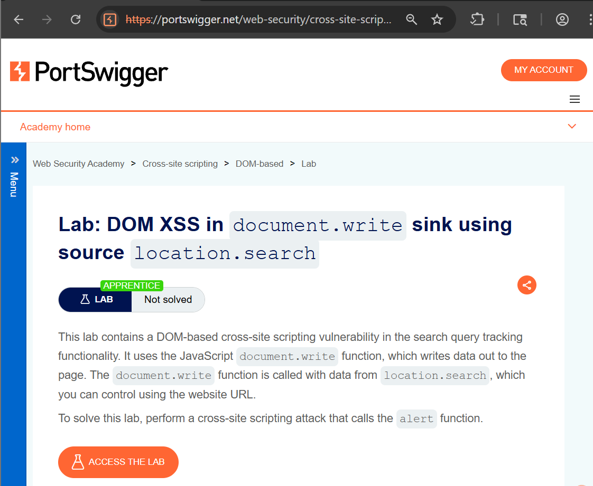
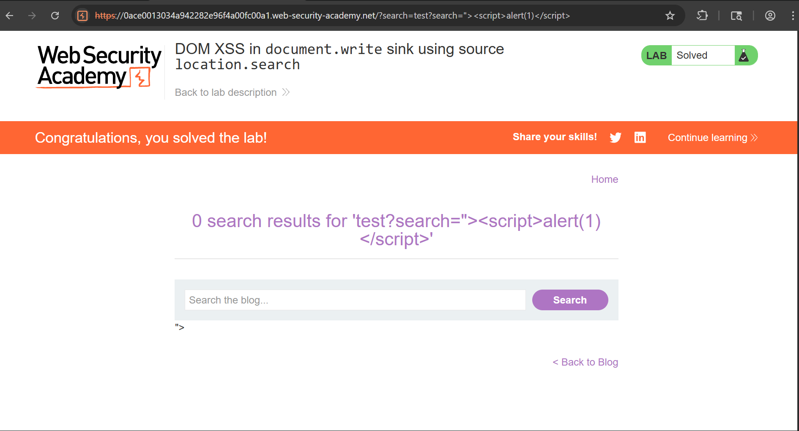
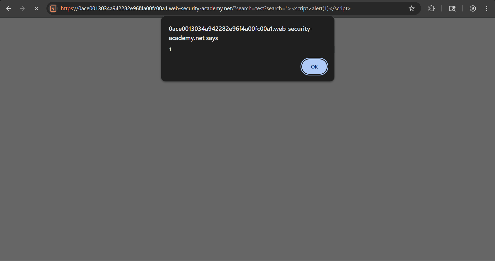

# DOM-Based XSS using document.write (location.search)

## Objective

The objective of this lab is to identify and exploit a **DOM-based Cross-Site Scripting (XSS)** vulnerability where user input from the URL is directly processed by client-side JavaScript and written into the DOM without proper sanitization.

---

## Tools Used

- Web Browser (Chrome)
- PortSwigger Web Security Academy

---

## What is DOM-Based XSS?

DOM-based XSS occurs when:
- The vulnerability exists in **client-side JavaScript (browser)**
- Data is taken from sources like `location.search`
- It is inserted into the page using unsafe methods like `document.write`

 Unlike other XSS types, **no server interaction is required**.

---

## Steps to Reproduce

### Step 1: Analyze the Lab

Open the lab and observe the search functionality.



---

### Step 2: Test Normal Input

Enter a normal value in the search bar:
---
test
---

Observe the URL:
---
?search=test
---

This shows that user input is taken from the URL.


---

### Step 3: Inject Malicious Payload

Replace the input with the following payload:
```html
"><script>alert(1)</script>
```

Final URL:
```text
?search="><script>alert(1)</script>
``` 



---

### Step 4: Execute Payload

Press Enter and observe the result.

A popup appears:
---
alert(1)
---

This confirms that JavaScript execution is successful.



---

## Result

- The payload executed successfully in the browser
- No server-side validation was involved
- The vulnerability exists in client-side JavaScript

---

## Impact

- Execution of malicious JavaScript in user browser
- Session hijacking
- Credential theft
- DOM manipulation

---

## CVSS Score

**CVSS v3.1 Score:** 6.5 (Medium)

### Vector:
---
CVSS:3.1/AV:N/AC:L/PR:N/UI:R/S:C/C:L/I:L/A:N
---

---

## CVSS Explanation

- **AV:N (Network):** Attack can be performed remotely  
- **AC:L (Low):** Easy to exploit  
- **PR:N (None):** No authentication required  
- **UI:R (Required):** Victim must interact (visit URL)  
- **S:C (Changed):** Affects browser execution  
- **C:L (Low):** Possible data exposure  
- **I:L (Low):** Content manipulation possible  
- **A:N (None):** No impact on availability  

---

## Difference from Other XSS Types

| Type | Execution Location |
|------|------------------|
| Reflected XSS | Server response |
| Stored XSS | Database |
| DOM XSS | Browser (JavaScript) |

---

## Conclusion

The application is vulnerable to DOM-based XSS because it uses `document.write` to insert user-controlled input from `location.search` into the DOM without sanitization. This allows attackers to execute arbitrary JavaScript in the victim's browser.

---

## Key Learning

- Never trust client-side input  
- Avoid unsafe JavaScript functions like `document.write`  
- Always sanitize and encode user input before rendering  