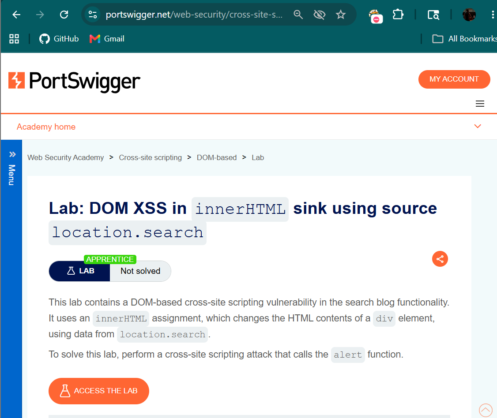
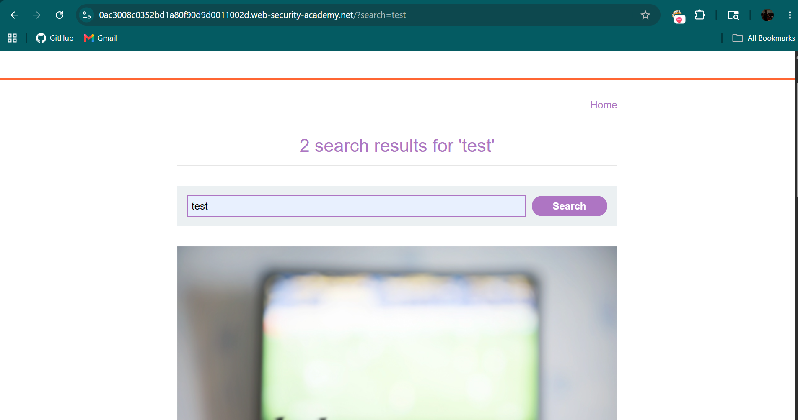
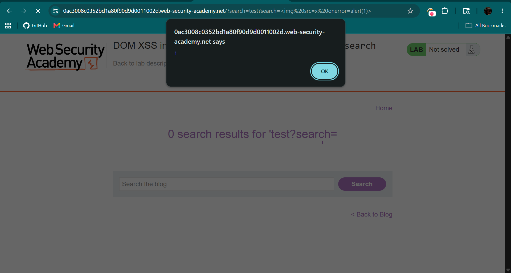

# DOM-Based XSS using innerHTML (location.search)

## Objective

The objective of this lab is to identify and exploit a **DOM-based Cross-Site Scripting (XSS)** vulnerability where user input from the URL is directly inserted into the DOM using `innerHTML` without proper sanitization.

---

## Tools Used

- Web Browser (Chrome)
- PortSwigger Web Security Academy

---

## Vulnerability Overview

DOM-based XSS occurs when:
- User input is processed by **client-side JavaScript**
- Data is taken from sources like `location.search`
- It is inserted into the page using unsafe sinks like `innerHTML`

 This allows attackers to inject malicious HTML/JavaScript that executes in the browser.

---

## Steps to Reproduce

---

### Step 1: Analyze the Lab

Open the lab and observe the search functionality.



---

### Step 2: Test Normal Input

Enter a normal value in the search bar:
```text
test
``` 
Observe the URL:
```text
?search=test
```

This confirms that user input is taken from the URL.



---

### Step 3: Inject Malicious Payload

Replace the input with the following payload:

```html

```
Final URL:
```text 
?search=
```
### Step 4: Execute Payload

Press Enter and observe the result.

- The image fails to load  
- The `onerror` event triggers JavaScript  

A popup appears:
```text
alert(1)
```



---

### Step 5: Lab Solved

The application confirms successful exploitation.


---

## Result

- Malicious payload executed successfully in the browser  
- No server-side validation involved  
- Vulnerability exists in client-side JavaScript  

---

## Impact

- Execution of arbitrary JavaScript in user browser  
- Session hijacking  
- Credential theft  
- DOM manipulation  

---

## CVSS Score

**CVSS v3.1 Score:** 6.5 (Medium)

### Vector:
```text
CVSS:3.1/AV:N/AC:L/PR:N/UI:R/S:C/C:L/I:L/A:N
```

---

## CVSS Explanation

- **AV:N (Network):** Attack can be performed remotely  
- **AC:L (Low):** Easy to exploit  
- **PR:N (None):** No authentication required  
- **UI:R (Required):** User must visit crafted URL  
- **S:C (Changed):** Affects browser execution context  
- **C:L (Low):** Possible data exposure  
- **I:L (Low):** Page content manipulation  
- **A:N (None):** No availability impact  

---

## Conclusion

The application is vulnerable to DOM-based XSS because it uses `innerHTML` to render user-controlled input from `location.search` without proper sanitization. This allows attackers to inject malicious HTML elements with event handlers that execute JavaScript in the victim’s browser.

---

## Key Learning

- Avoid using `innerHTML` with untrusted data  
- Prefer safer methods like `textContent`  
- Always sanitize and encode user input  