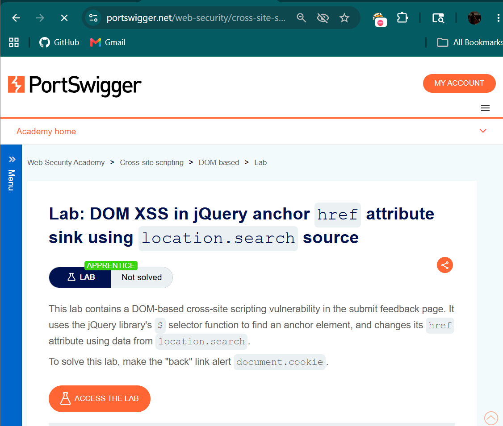
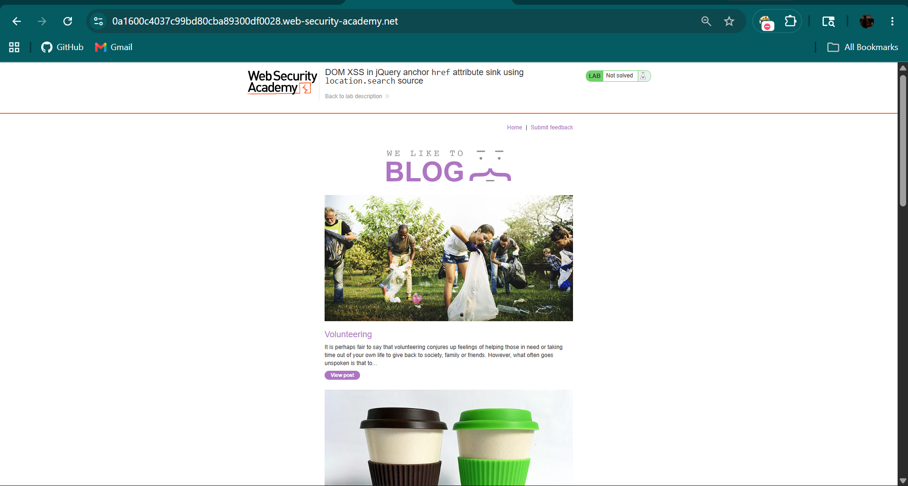
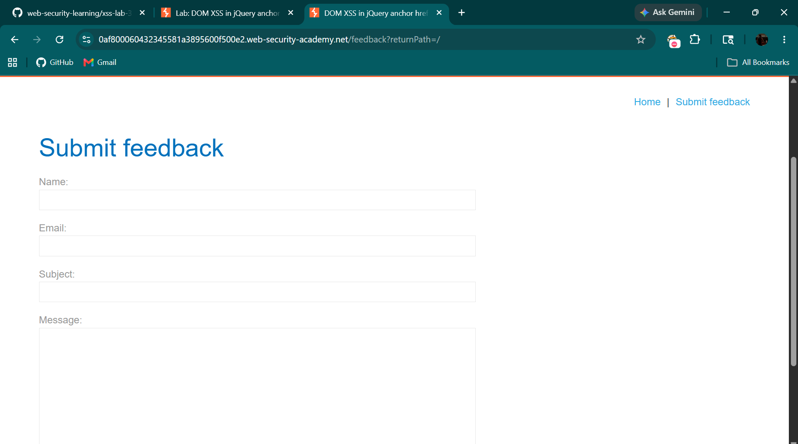
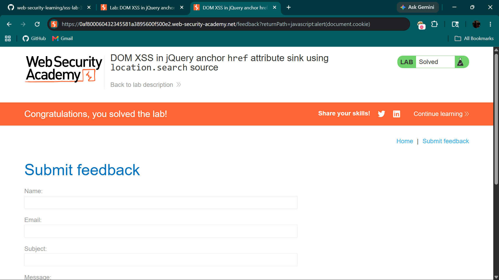

# DOM XSS in jQuery Anchor Href Attribute

## Objective

The objective of this lab is to identify and exploit a **DOM-based Cross-Site Scripting (XSS)** vulnerability where user input from the URL is used to dynamically set the `href` attribute of an anchor tag without proper validation.

---

## Tools Used

- Web Browser (Chrome)
- PortSwigger Web Security Academy

---

## Vulnerability Overview

DOM-based XSS occurs when:
- User input is processed by **client-side JavaScript**
- Data is taken from sources like `location.search`
- It is inserted into unsafe sinks like the `href` attribute

This allows attackers to inject a `javascript:` payload which executes when the user interacts with the element.

---

## Steps to Reproduce

---

### Step 1: Analyze the Lab

Open the lab and observe the blog homepage.



---

### Step 2: Navigate to Homepage

After starting the lab, the blog homepage is displayed.



---

### Step 3: Go to Feedback Page

- Open any blog post  
- Click on **Submit feedback**

This navigates to the feedback page with a `returnPath` parameter.



---

### Step 4: Inject Malicious Payload

Modify the URL parameter:

```text
/feedback?returnPath=javascript:alert(document.cookie)
```



---

### Step 5: Execute Payload

Click the **Back** button on the page.

- The link uses the injected value in `href`
- The `javascript:` payload executes

A popup appears:
```text
alert(document.cookie)
```

---

## Result

- Malicious payload executed successfully  
- Input directly reflected into `href` attribute  
- Vulnerability exists in client-side JavaScript  

---

## Impact

- Execution of arbitrary JavaScript  
- Cookie theft  
- Session hijacking  
- User redirection  

---

## CVSS Score

**CVSS v3.1 Score:** 6.1 (Medium)

### Vector:
```text
CVSS:3.1/AV:N/AC:L/PR:N/UI:R/S:C/C:L/I:L/A:N
```

---

## CVSS Explanation

- **AV:N (Network):** Exploitable remotely  
- **AC:L (Low):** Easy to exploit  
- **PR:N (None):** No authentication required  
- **UI:R (Required):** User interaction needed (click)  
- **S:C (Changed):** Affects execution context  
- **C:L (Low):** Possible data exposure  
- **I:L (Low):** Content manipulation  
- **A:N (None):** No availability impact  

---

## Conclusion

The application is vulnerable to DOM-based XSS because it directly assigns user-controlled input to the `href` attribute using jQuery without validation. This allows attackers to inject a `javascript:` payload that executes when the user clicks the link.

---

## Key Learning

- Avoid assigning user input directly to `href`  
- Validate and sanitize URL parameters  
- Avoid using `javascript:` URLs  
- Use safe DOM manipulation practices  