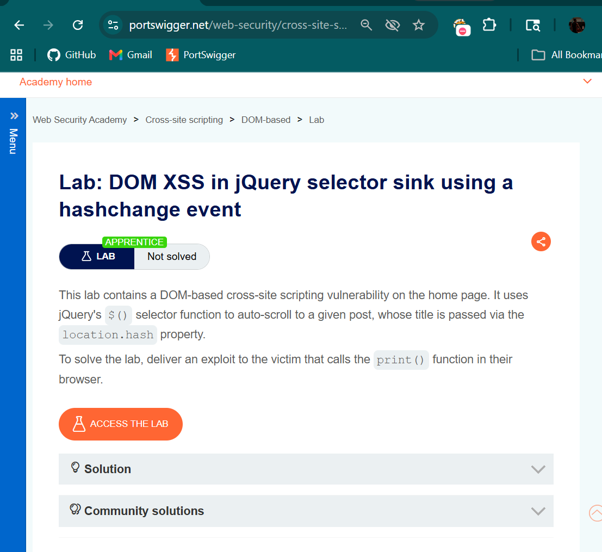
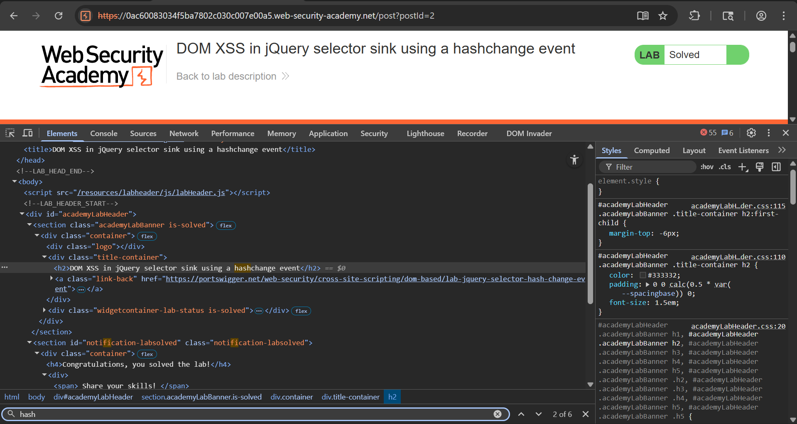
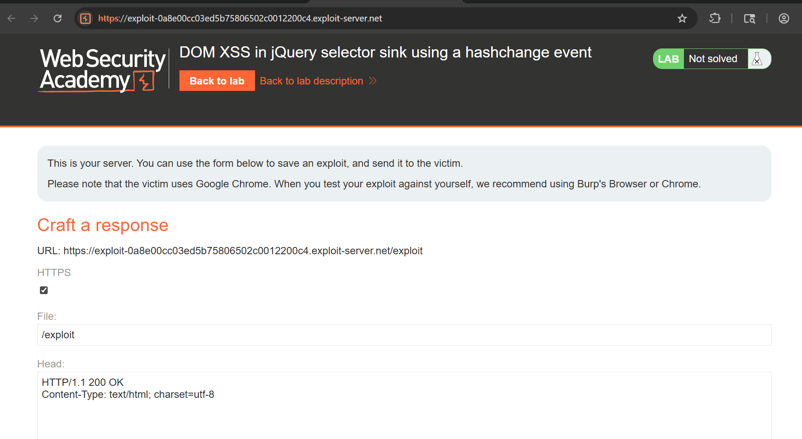
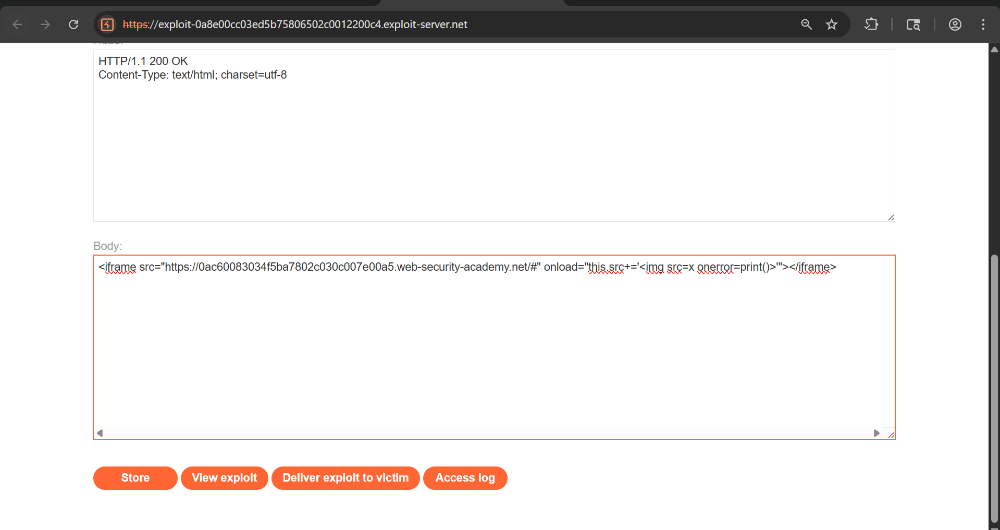
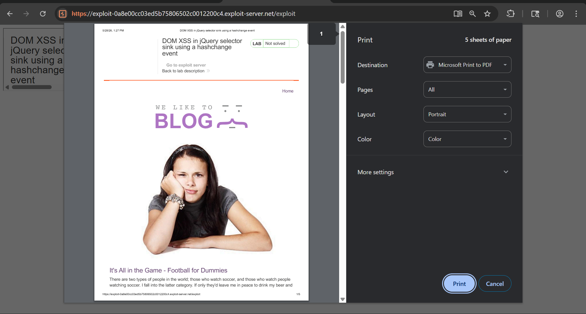
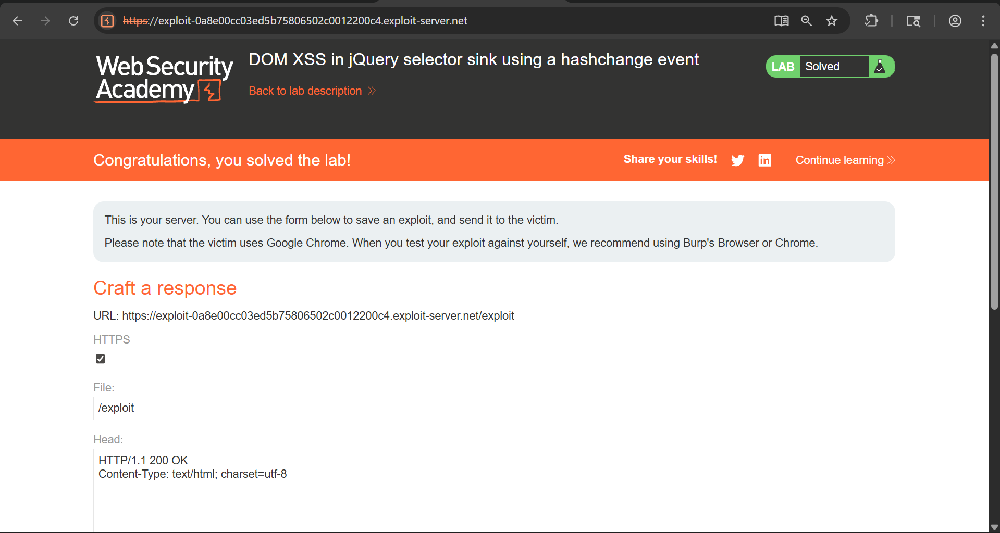

# DOM XSS in jQuery Selector Sink using hashchange Event

## Objective

The objective of this lab is to identify and exploit a **DOM-based Cross-Site Scripting (XSS)** vulnerability where user-controlled input from the URL fragment (`location.hash`) is processed unsafely within a jQuery selector.

---

## Tools Used

- Web Browser (Chrome)
- Browser Developer Tools (DevTools)
- PortSwigger Web Security Academy
- Exploit Server

---

## Vulnerability Overview

DOM-based XSS occurs when client-side JavaScript processes untrusted input and inserts it into the DOM without proper validation.

In this lab:

- The application reads input from `location.hash`
- A `hashchange` event is triggered when the fragment changes
- The value is directly used inside a jQuery selector

This creates a vulnerability where attackers can inject malicious HTML/JavaScript that executes in the victim’s browser.

---

## Steps to Reproduce

---

### Step 1: Open the Lab

Start the lab and observe the blog interface.



---

### Step 2: Identify Vulnerable Behavior

Inspect the page to observe usage of `location.hash`.



---

### Step 3: Open Exploit Server

Click on **"Go to exploit server"** from the lab banner.



---

### Step 4: Inject Malicious Payload

In the Body section, insert the following payload:

```html
<iframe src="https://YOUR-LAB-ID.web-security-academy.net/#" onload="this.src+=''"></iframe>
```



---

### Step 5: Test the Exploit

Click **View exploit** to verify execution.

- The page loads inside an iframe  
- The malicious payload is appended  
- The `print()` function is triggered  



---

### Step 6: Deliver Exploit

Click **Deliver to victim** to complete the lab.



---

## Result

- Malicious payload executed successfully  
- Vulnerability confirmed in client-side JavaScript  
- Exploit delivered using an iframe  

---

## Impact

- Execution of arbitrary JavaScript in the victim’s browser  
- Possibility of session hijacking  
- Phishing and redirection attacks  
- DOM manipulation  

---

## Mitigation

- Avoid using user-controlled input directly in jQuery selectors  
- Sanitize and validate data from `location.hash` before using it  
- Use safe DOM manipulation methods instead of dynamic selectors  
- Implement Content Security Policy (CSP) to reduce XSS impact  

---

## CVSS Score

**CVSS v3.1 Score:** 6.5 (Medium)

```text
CVSS:3.1/AV:N/AC:L/PR:N/UI:R/S:C/C:L/I:L/A:N
```

---

## Conclusion

The vulnerability exists because the application directly uses `location.hash` inside a jQuery selector without sanitization. By leveraging the exploit server, we successfully executed arbitrary JavaScript in the victim’s browser.

---

## Key Learning

- Avoid using user-controlled input in jQuery selectors  
- Always sanitize data from `location.hash`  
- Handle DOM updates securely  
- Use exploit servers to simulate real-world attack scenarios  