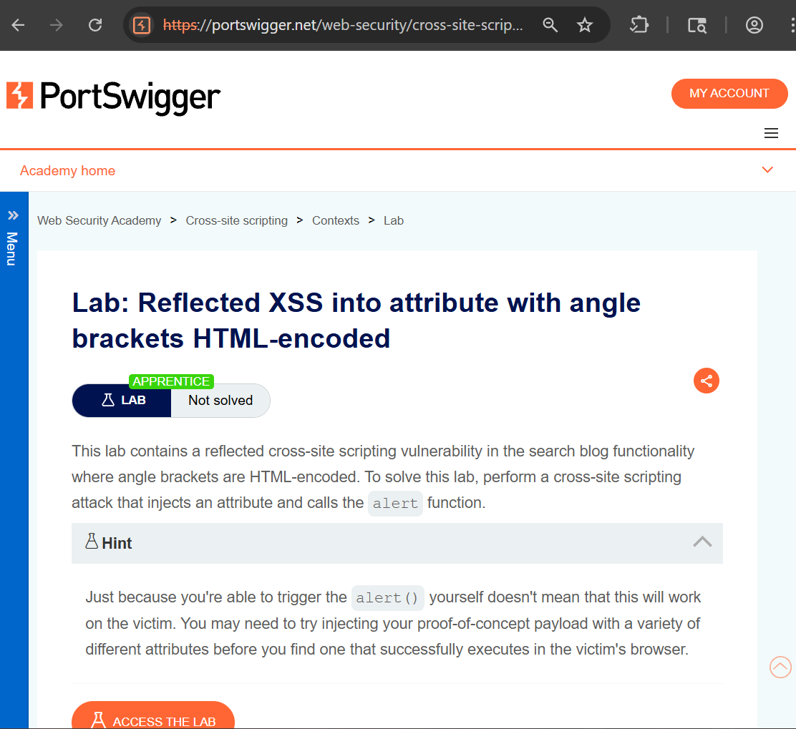
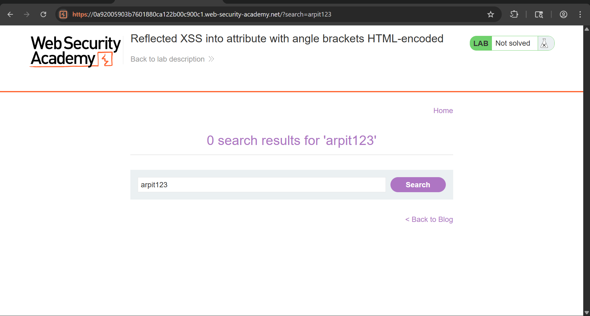
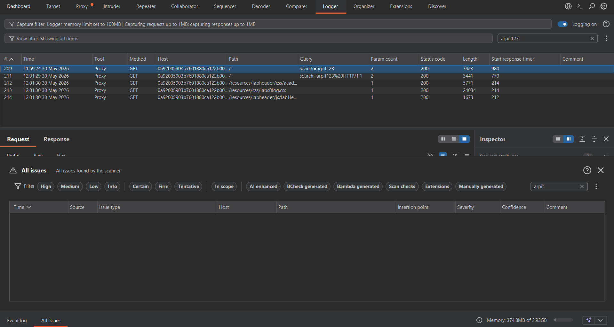
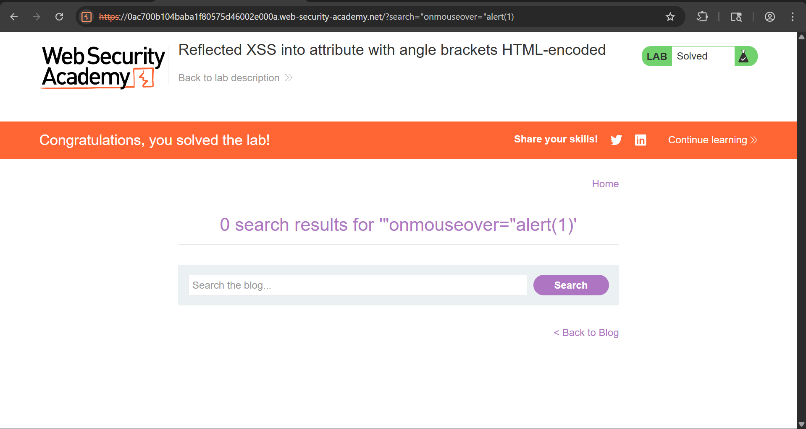
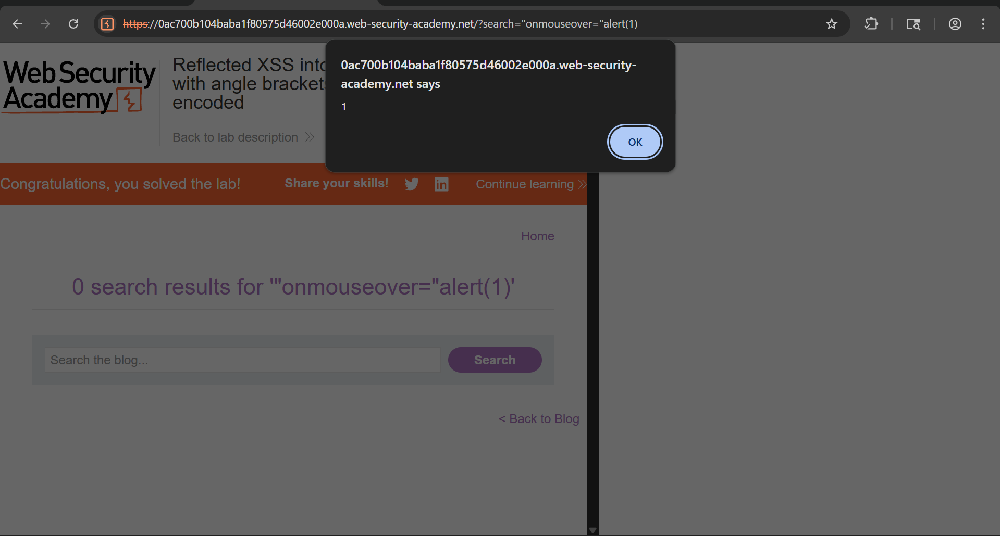
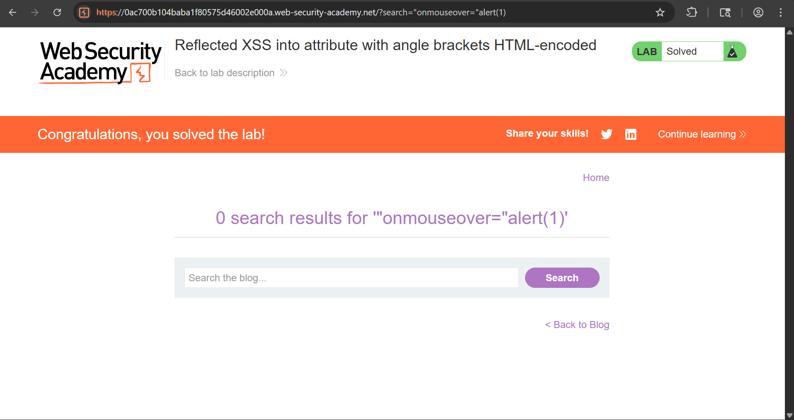

# Reflected XSS into Attribute with Angle Brackets HTML-encoded

## Objective

The objective of this lab is to identify and exploit a **Reflected Cross-Site Scripting (XSS)** vulnerability where user input is reflected inside an HTML attribute. Although angle brackets (`<` and `>`) are HTML-encoded, it is still possible to escape the attribute context and inject an event handler that executes JavaScript.

---

## Tools Used

- Web Browser (Chrome)
- Browser Developer Tools (DevTools)
- Burp Suite Community Edition
- PortSwigger Web Security Academy

---

## Vulnerability Overview

Reflected XSS occurs when user-supplied data is immediately returned by the application and rendered in the browser without proper sanitization.

In this lab:

- User input is reflected inside a quoted HTML attribute.
- Angle brackets are HTML-encoded, preventing direct tag injection.
- The application fails to properly encode quotation marks.
- An attacker can escape the existing attribute and inject a malicious event handler.

As a result, arbitrary JavaScript can be executed when a victim interacts with the affected element.

---

## Steps to Reproduce

---

### Step 1: Open the Lab

Launch the lab and review the description to understand the vulnerability scenario.



---

### Step 2: Test Normal Input

Enter a random alphanumeric value in the search box:

```text
arpit123
```

Submit the search request and observe the results page.



---

### Step 3: Verify Reflection

Intercept the request using Burp Suite and send it to Repeater.

Search for the input value in the response and observe that it appears inside a quoted HTML attribute.

Example:

```html
<input value="arpit123">
```

This confirms that the application reflects user input into an HTML attribute.



---

### Step 4: Inject Malicious Payload

Replace the original input with the following payload:

```html
"onmouseover="alert(1)
```

Example request:

```http
GET /?search="onmouseover="alert(1)
```

This payload closes the existing attribute and injects a new event handler.



---

### Step 5: Trigger the Payload

Load the modified URL in the browser and move the mouse pointer over the affected element.

When the `onmouseover` event is triggered, JavaScript executes:

```javascript
alert(1)
```



---

### Step 6: Lab Solved

After successful execution of the payload, the application confirms that the lab has been solved.



---

## Result

- Successfully escaped the HTML attribute context.
- Injected a malicious event handler.
- Executed arbitrary JavaScript in the browser.
- Confirmed the presence of a Reflected XSS vulnerability.

---

## Impact

- Execution of arbitrary JavaScript in a victim's browser.
- Session hijacking opportunities.
- Credential theft through phishing techniques.
- Unauthorized actions performed on behalf of users.
- Website content manipulation and redirection attacks.

---

## Mitigation

- Properly encode user input before inserting it into HTML attributes.
- Use contextual output encoding.
- Implement a strong Content Security Policy (CSP).
- Validate and sanitize all user-controlled data.
- Use secure frameworks that automatically handle output encoding.

---

## CVSS Score

**CVSS v3.1 Score:** 6.1 (Medium)

```text
CVSS:3.1/AV:N/AC:L/PR:N/UI:R/S:C/C:L/I:L/A:N
```

---

## CVSS Explanation

- **AV:N (Network):** Exploitable remotely over a network.
- **AC:L (Low):** Requires minimal effort to exploit.
- **PR:N (None):** No authentication required.
- **UI:R (Required):** Victim interaction is necessary.
- **S:C (Changed):** Impacts a different security scope.
- **C:L (Low):** Limited disclosure of sensitive information.
- **I:L (Low):** Possible modification of page content.
- **A:N (None):** No direct impact on availability.

---

## Conclusion

This lab demonstrates how Reflected XSS can occur even when angle brackets are HTML-encoded. By escaping a quoted attribute and injecting an event handler, arbitrary JavaScript execution becomes possible. Proper contextual output encoding and secure handling of user input are essential to prevent this type of vulnerability.

---

## Key Learning

- HTML encoding of angle brackets alone is not sufficient to prevent XSS.
- Attribute contexts require dedicated output encoding.
- Event handlers such as `onmouseover` can be abused for code execution.
- Always validate and encode user input based on its rendering context.
- Reflected XSS vulnerabilities can often be exploited with simple payloads when output encoding is incomplete.