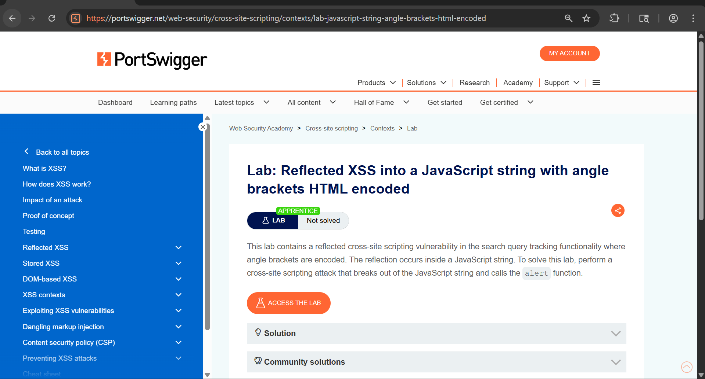
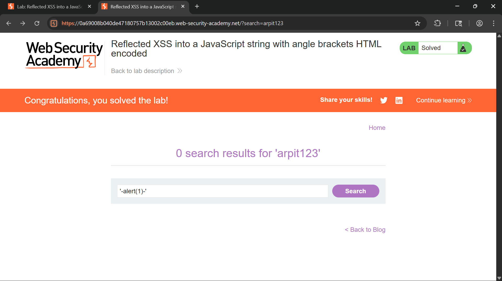
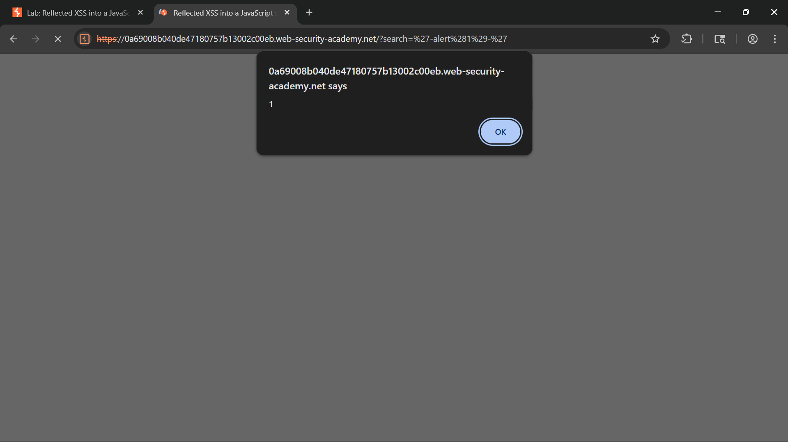
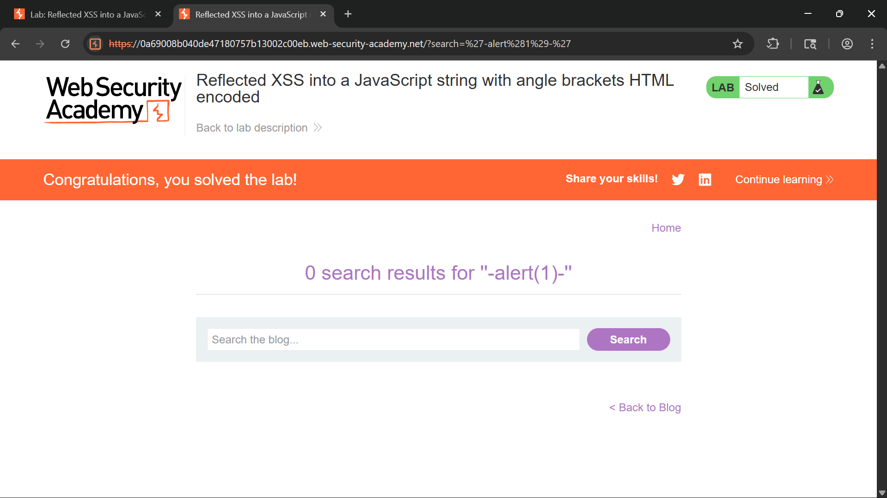

# Reflected XSS into a JavaScript String with Angle Brackets HTML Encoded

## Objective

The objective of this lab is to identify and exploit a Reflected Cross-Site Scripting (XSS) vulnerability where user-controlled input is reflected inside a JavaScript string. Although angle brackets are HTML-encoded, the application fails to properly handle JavaScript string delimiters, allowing arbitrary JavaScript execution.

---

## Tools Used

- Web Browser (Chrome)
- Burp Suite Community Edition
- Browser Developer Tools (DevTools)
- PortSwigger Web Security Academy

---

## Vulnerability Overview

Reflected Cross-Site Scripting (XSS) occurs when user input is immediately returned in an application's response without proper context-aware encoding.

In this lab, the search term is embedded inside a JavaScript string used by the application's client-side functionality. While the application encodes angle brackets to prevent basic HTML injection, it does not properly escape single quotes within the JavaScript context.

Because of this, an attacker can terminate the original string and inject executable JavaScript code.

Example:

```javascript
var searchTerms = 'user_input';
```

If the application fails to escape quotes correctly, user input can modify the intended script behavior and execute arbitrary code.

---

## Steps to Reproduce

### Step 1: Open the Lab

Launch the lab and review the vulnerability description.



---

### Step 2: Submit a Normal Search Query

Enter a random value in the search box:

```text
test
```

Submit the search request.

This helps identify where user input is reflected within the application.


---

### Step 3: Identify Reflection in JavaScript

Intercept the request using Burp Suite and send it to Repeater.

Locate the search value in the response.

Example:

```javascript
var searchTerms = 'test';
```

This confirms that the search parameter is reflected inside a JavaScript string.


---

### Step 4: Inject a Payload

Replace the search term with the following payload:

```javascript
'-alert(1)-'
```

Modified URL:

```text
?search='-alert(1)-'
```

This payload closes the existing string, executes JavaScript, and then reopens the string to maintain valid syntax.



---

### Step 5: Execute the Payload

Copy the generated URL and open it in the browser.

When the page loads, the JavaScript interpreter processes:

```javascript
''-alert(1)-''
```

The injected code executes and triggers:

```javascript
alert(1)
```



---

### Step 6: Lab Solved

After successful execution of the payload, the application confirms that the lab has been solved.



---

## Technical Analysis

### Why Does the Payload Work?

Original JavaScript:

```javascript
var searchTerms = 'test';
```

Injected payload:

```javascript
'-alert(1)-'
```

Resulting script:

```javascript
var searchTerms = ''-alert(1)-'';
```

The first quote closes the original string.

```javascript
''
```

The JavaScript interpreter then evaluates:

```javascript
-alert(1)-
```

which executes:

```javascript
alert(1)
```

Finally, the remaining quote keeps the script syntactically valid.

This technique is known as **breaking out of a JavaScript string context**.

---

## Result

- Successfully identified reflection inside a JavaScript string.
- Escaped the intended string context.
- Executed arbitrary JavaScript code.
- Confirmed the presence of a Reflected XSS vulnerability.
- Successfully solved the lab.

---

## Impact

A real-world attacker could potentially:

- Execute arbitrary JavaScript in victim browsers.
- Steal session cookies and authentication tokens.
- Perform actions on behalf of authenticated users.
- Deliver phishing content through trusted pages.
- Redirect users to malicious websites.
- Modify page content dynamically.

---

## Mitigation

To prevent this vulnerability:

- Apply context-aware output encoding.
- Escape quotation marks before rendering user input in JavaScript.
- Avoid dynamically generating JavaScript using user-controlled data.
- Use secure templating frameworks.
- Implement a strong Content Security Policy (CSP).
- Validate and sanitize all user-supplied input.

Example of safer handling:

```javascript
const searchTerm = JSON.stringify(userInput);
```

or

```javascript
element.textContent = userInput;
```

instead of directly embedding user input inside scripts.

---

## CVSS Score

**CVSS v3.1 Score:** 6.5 (Medium)

### Vector

```text
CVSS:3.1/AV:N/AC:L/PR:N/UI:R/S:C/C:L/I:L/A:N
```

---

## CVSS Explanation

- **AV:N** – Exploitable remotely over a network.
- **AC:L** – Low attack complexity.
- **PR:N** – No privileges required.
- **UI:R** – Requires victim interaction.
- **S:C** – Impacts a different security scope.
- **C:L** – Limited confidentiality impact.
- **I:L** – Limited integrity impact.
- **A:N** – No availability impact.

---

## Conclusion

This lab demonstrates how applications can remain vulnerable to XSS even when angle brackets are properly encoded. Security controls must account for the context in which data is rendered. Because user input was embedded directly inside a JavaScript string without appropriate escaping, it was possible to terminate the string and execute arbitrary JavaScript code. This highlights the importance of context-aware encoding and secure handling of user-controlled input.

---

## Key Learning

- XSS is not limited to HTML injection.
- JavaScript contexts require dedicated escaping mechanisms.
- Angle bracket encoding alone is insufficient protection.
- User-controlled input should never be inserted directly into executable code.
- Understanding rendering context is critical when testing for XSS vulnerabilities.